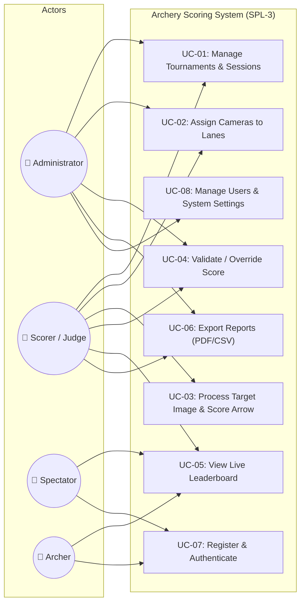
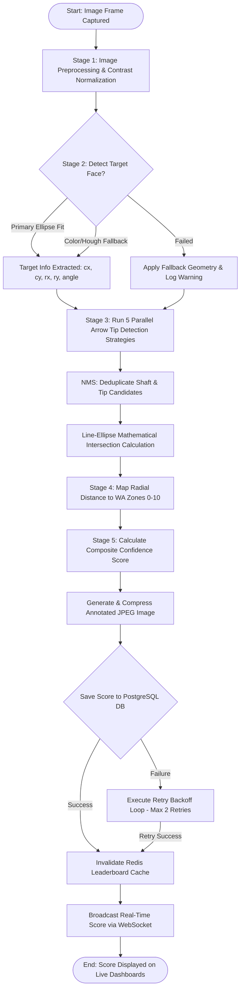
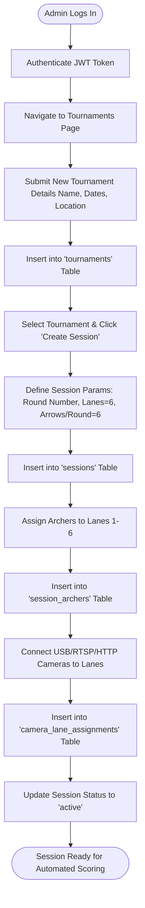
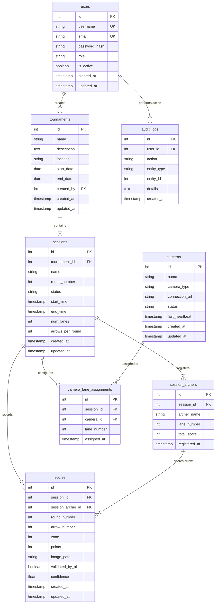
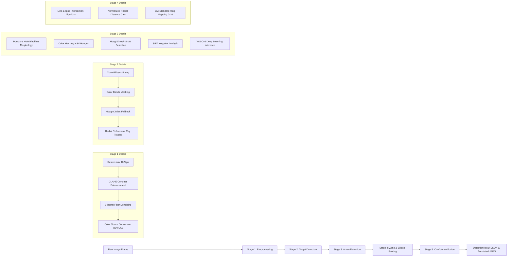
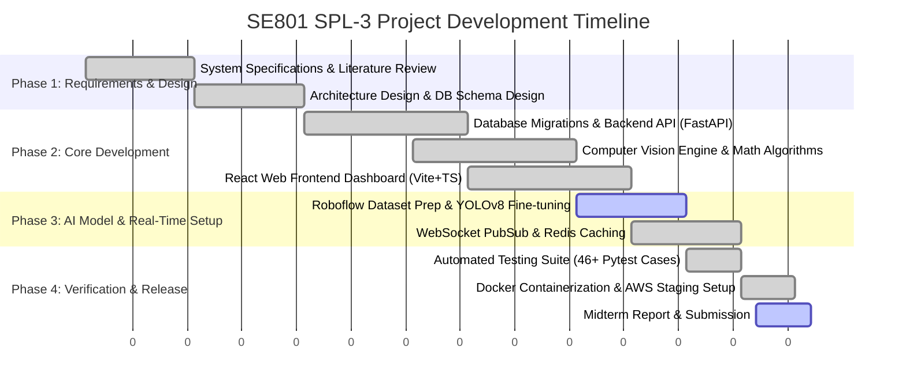

# SE801: Project Midterm Technical Report
## Real-Time Automated Archery Target Detection & Scoring System (SPL-3)

**Course**: SE801 Software Engineering Project / SPL-3  
**Project Title**: Real-Time Automated Archery Target Detection & Scoring System  
**System Version**: v1.0.0 (Production-Ready Backend & Integrated AI Scoring Engine)  
**Date**: July 2026  
**Document Status**: Final Midterm Technical Report  

---

## Executive Summary

The **Real-Time Automated Archery Target Detection & Scoring System** is an AI-assisted, multi-tenant software application designed to eliminate human bias, manual delay, and scoring disputes in archery competitions. Utilizing advanced Computer Vision (OpenCV), YOLOv8 object detection, and a high-performance FastAPI/React web stack, the system automatically captures target face images from shooting lanes, detects arrow tip coordinates with subpixel precision, determines World Archery (WA) standard ring scores (0–10 and X-ring), updates real-time leaderboards via WebSockets and Redis caching, and provides comprehensive analytics reports in PDF, CSV, and JSON formats.

This technical report provides an exhaustive overview of the system architecture, requirements analysis, structural and behavioral modeling, entity-relationship data design, AI/CV engineering pipeline, preliminary testing suite, and project execution timeline.

---

## Table of Contents

1. [Project Overview](#1-project-overview)
   - 1.1 Project Title
   - 1.2 Problem Statement
   - 1.3 Objectives
   - 1.4 System Scope
   - 1.5 Key Project Deliverables
2. [Requirements Analysis](#2-requirements-analysis)
   - 2.1 Functional Requirements (FR)
   - 2.2 Non-Functional Requirements (NFR)
   - 2.3 System Stakeholders
3. [System Modeling](#3-system-modeling)
   - 3.1 Use Case Model & Detailed Descriptions
   - 3.2 System Activity Models
4. [Data & Information Modeling](#4-data--information-modeling)
   - 4.1 Database Architecture & Entity Relationship Diagram
   - 4.2 Relational Database Schema Specifications
   - 4.3 AI Training Dataset Description (Roboflow YOLOv8 Format)
5. [Software Design](#5-software-design)
   - 5.1 System Component Architecture
   - 5.2 Layered System Design & Interactions
6. [AI Engineering Design](#6-ai-engineering-design)
   - 6.1 Multi-Stage Computer Vision & AI Pipeline
   - 6.2 Model Selection & Architecture Rationale
   - 6.3 Prompt Design, Heuristic Rules Engine & Mathematical Scoring Formulations
7. [Preliminary Test Plan](#7-preliminary-test-plan)
   - 7.1 Testing Objectives
   - 7.2 Features to be Tested & Automated Verification Suite
8. [Timeline](#8-timeline)
   - 8.1 Project Work Breakdown & Gantt Chart
   - 8.2 Current Progress & Future Milestones

---

## 1. Project Overview

### 1.1 Project Title
**Real-Time Automated Archery Target Detection & Scoring System (SPL-3 / SE801)**

### 1.2 Problem Statement
Traditional archery competition management and scoring rely heavily on manual human observation and paper-based scorecards. Scorers and archers must physically walk to the target butt after each end (3 or 6 arrows) to record scores, manually evaluate close line-touching arrows ("line cutters"), and visually resolve disputes. This traditional workflow presents several critical issues:

1. **Human Error & Dispute Delays**: Disagreements over line-touching arrows frequently halt competitions while target judges inspect arrows with magnifying optics.
2. **High Latency & Lack of Spectator Engagement**: Spectators, coaches, and viewers experience significant delays before learning scores, as scores are tallied manually at the end of rounds.
3. **High Hardware Cost of Commercial Systems**: Existing electronic scoring targets (e.g., acoustic or laser-grid targets) require expensive specialized hardware costing thousands of dollars per lane, making them inaccessible for local clubs and collegiate tournaments.
4. **Lighting & Perspective Degradation**: Standard optical sensors fail under varying outdoor sunlight, camera tilt angles, shadows, or when target faces are worn and covered with multiple previous arrow puncture marks.

### 1.3 Objectives
The primary objective of this project is to develop an accessible, high-accuracy, camera-based automated scoring solution leveraging standard optical cameras (USB, RTSP, HTTP streams) and state-of-the-art computer vision / deep learning.

Specific technical objectives include:
* **Sub-2-Second Detection Latency**: Process shooting lane images, detect target boundaries, identify arrow impact tips, and record scores in under 2.0 seconds.
* **World Archery (WA) Compliance**: Implement precise elliptical perspective normalization and mathematical line-ellipse intersection algorithms to score arrows according to World Archery target face specifications (Zones 1 to 10 + X-ring).
* **Automated Multi-Method AI Engine**: Combine YOLOv8 object detection with multi-spectral CV fallback pipelines (puncture hole morphological blackhat, color segmentation, Canny edge HoughLines, SIFT keypoints) to maintain >95% scoring accuracy.
* **Real-Time Tournament Management**: Provide a full-featured FastAPI backend with 26 REST endpoints, WebSocket live score broadcasts, Redis caching, and a responsive React (Vite+TypeScript) frontend dashboard.

### 1.4 System Scope

#### In-Scope
* **Target & Camera Calibration**: Perspective transformation, ring geometry estimation, camera stream registration (USB/RTSP/HTTP).
* **AI & CV Pipeline**: Automatic target center localization, arrow shaft detection, puncture hole identification, subpixel tip positioning, line-ellipse intersection, confidence scoring.
* **Tournament & Session Workflow**: Role-Based Access Control (RBAC for Admin, Scorer, Spectator, Archer), Tournament/Session CRUD, Archer lane assignments, end-by-end score tracking.
* **Live Broadcast & Caching**: WebSocket event emission on score capture, Redis-cached leaderboards with 1-minute TTL fallback.
* **Reporting & Data Export**: Scorecard generation in PDF, CSV, and raw JSON formats.
* **Infrastructure**: Docker containerization (`docker-compose`), Alembic database versioning, PostgreSQL persistence.

#### Out-of-Scope
* Physical manufacturing of optical camera hardware or robotic arm target setters.
* Automated arrow retrieval or physical target face replacement mechanisms.

### 1.5 Key Project Deliverables
1. **Core Backend Engine**: Python 3.11 FastAPI service containing 26 REST endpoints, 1 WebSocket route, and 3-layer architecture (API → Service → Repository).
2. **AI Computer Vision Pipeline**: `ArrowDetectionService` (2,600+ LOC) implementing 5 target localization strategies, 5 arrow detection algorithms, line-ellipse mathematical intersection, and subpixel refinement.
3. **Trained Object Detection Model**: YOLOv8 model trained on 504 annotated target face images (Roboflow dataset) for ring and arrow bounding box detection.
4. **Web Frontend Dashboard**: React 18 + Vite + TypeScript application with 8 management pages (Dashboard, Scoring, Tournaments, Cameras, Reports, Users, Settings, Login).
5. **Database & Persistence Layer**: PostgreSQL schema with 8 relational tables, complete foreign key integrity, and Alembic migration scripts.
6. **Automated Test Suite**: `pytest` verification suite with 46+ unit and integration tests achieving 74% code coverage.
7. **Comprehensive Documentation**: Architectural specifications, API references, database schemas, deployment guides, and user manuals.

---

## 2. Requirements Analysis

### 2.1 Functional Requirements (FR)

| Requirement ID | Module | Detailed Description | Priority |
| :--- | :--- | :--- | :--- |
| **FR-01** | User Management | The system shall support user registration, authentication via JWT tokens, bcrypt password hashing, and Role-Based Access Control (Admin, Scorer, Spectator, Archer). | High |
| **FR-02** | Tournament Setup | The system shall allow Admins and Scorers to create, edit, list, and archive tournament events with start/end dates, descriptions, and venue locations. | High |
| **FR-03** | Session Management | The system shall support creating shooting sessions/rounds within tournaments, specifying shooting lane counts (default 6) and arrows per end (default 6). | High |
| **FR-04** | Archer & Lane Assignment | The system shall register archers into specific sessions and assign them to unique shooting lanes (1 archer per lane per session). | High |
| **FR-05** | Camera Stream Integration | The system shall manage camera devices across USB, RTSP streams, and HTTP feeds, maintaining heartbeat checks and automated reconnection logic. | High |
| **FR-06** | Automated Image Capture | The system shall capture image frames on demand or via stream triggers per lane, transmitting images to the scoring engine. | High |
| **FR-07** | Target & Arrow Detection | The system shall automatically detect target face boundaries and arrow tip impact coordinates using the multi-stage AI pipeline. | High |
| **FR-08** | WA Zone Score Calculation | The system shall calculate arrow scores (0 to 10 points and X-ring determination) using normalized elliptical radial distances from the bullseye center. | High |
| **FR-09** | Manual Score Override | The system shall allow authorized Scorers and Admins to inspect captured images (with overlay annotations) and manually override or validate scores. | High |
| **FR-10** | Real-Time Broadcast | The system shall broadcast real-time score updates to connected frontend clients via WebSockets upon each score submission. | High |
| **FR-11** | Leaderboard & Caching | The system shall compute live session leaderboards ordered by total points, utilizing Redis caching with automatic cache invalidation on score writes. | Medium |
| **FR-12** | Analytics & Reporting | The system shall generate downloadable performance reports and official scorecards in PDF, CSV, and JSON formats. | Medium |
| **FR-13** | Activity Audit Logging | The system shall record administrative actions, score edits, and system configuration modifications in an `audit_logs` table for compliance. | Medium |

### 2.2 Non-Functional Requirements (NFR)

#### Performance & Responsiveness (NFR Pattern #10, #12, #13)
* **Processing Latency**: Automated AI image scoring must complete within **2.0 seconds** per image (target detection < 800ms, arrow detection < 1000ms).
* **API Response Time**: Standard REST API endpoints (non-image) must respond within **100ms** under normal load.
* **Real-Time Latency**: WebSocket score broadcast propagation to web UI must be under **50ms**.
* **Image Compression**: Saved annotated images must be compressed using JPEG Quality 70 to minimize storage bandwidth without compromising inspection clarity.

#### Reliability, Availability & Recovery (NFR Pattern #1, #2, #4, #9, #14)
* **DB Resilience (Pattern #1)**: PostgreSQL connection failures must trigger exponential backoff retry mechanisms (`min_size=5, max_size=20, recycle=3600s`).
* **Scoring Failover (Pattern #2)**: Database score write attempts must retry up to 2 times with backoff before raising an application error event.
* **CV Pipeline Fallback (Pattern #4)**: Arrow detection must attempt 5 parallel strategies (puncture hole, color segmentation, HoughLines, contour aspect ratio, SIFT) to guarantee detection fallback.
* **Storage Quota (Pattern #9)**: Storage management must enforce a 10GB total storage ceiling with automatic 90-day image archival.

#### Security & Access Control (NFR Pattern #17, #18, #20)
* **Password Hashing**: Passwords must be hashed using `bcrypt` with a work factor of 12 rounds.
* **Session Tokens**: Authentication tokens must use HS256 JWT with configurable expiration (60 minutes).
* **Rate Limiting (Pattern #17)**: Public endpoints must enforce rate limiting to prevent denial-of-service (DoS) attacks.
* **CORS Policy (Pattern #20)**: Cross-Origin Resource Sharing must strictly enforce origin whitelists configured in environment settings.
* **Structured Audit Logging (Pattern #18)**: System errors and key state mutations must be logged via structured logging with unique request correlation tracking.

### 2.3 System Stakeholders

```
                                  ┌───────────────────────────┐
                                  │    System Stakeholders    │
                                  └─────────────┬─────────────┘
                                                │
         ┌──────────────────┬───────────────────┼───────────────────┬──────────────────┐
         ▼                  ▼                   ▼                   ▼                  ▼
  ┌──────────────┐   ┌──────────────┐    ┌──────────────┐    ┌──────────────┐   ┌──────────────┐
  │   Archery    │   │ Event Scorer │    │ Tournament   │    │ Spectators & │   │ Software &   │
  │  Athletes    │   │  & Umpire    │    │ Admin / Host │    │ Audience     │   │ AI Engineers │
  └──────────────┘   └──────────────┘    └──────────────┘    └──────────────┘   └──────────────┘
```

1. **Archery Athletes / Competitors**: Primary subjects who shoot arrows. Rely on instant, fair, non-biased scoring and immediate performance feedback on lane monitors.
2. **Event Scorers & Umpires**: Field officials responsible for supervising sessions, reviewing low-confidence AI detections, validating scores, and resolving edge-case disputes.
3. **Tournament Administrators**: Event hosts who configure tournaments, setup shooting sessions, assign lanes and cameras, manage user permissions, and issue official tournament certificates/reports.
4. **Spectators & Audience**: Remote viewers and stadium fans who view real-time leaderboards, shot placements, and live statistics on web dashboards or stadium screens.
5. **Software & AI Engineers**: System maintainers responsible for model training, CV pipeline optimization, server deployment, and system uptime.

---

## 3. System Modeling

### 3.1 Use Case Model & Detailed Descriptions

#### Use Case Diagram



#### Detailed Use Case Descriptions

##### Use Case UC-01: Manage Tournaments & Shooting Sessions
* **Primary Actor**: Administrator / Event Scorer.
* **Preconditions**: User is authenticated with `admin` or `scorer` role permissions.
* **Main Success Scenario**:
  1. User opens `/tournaments` page and submits tournament details (Name, Location, Start/End Dates, Description).
  2. System validates date ranges and inserts tournament record into `tournaments` table.
  3. User selects the created tournament and clicks "Create Session", defining round number, lane count (default 6), and arrows per round (default 6).
  4. System creates session record with status `active` in `sessions` table.
  5. User registers archers into the session, assigning each archer to a unique shooting lane.
  6. System populates `session_archers` table with registered lane entries.
* **Extensions / Alternate Flow**:
  * *Invalid Date Range*: System returns HTTP 400 error if end date precedes start date.
  * *Duplicate Round*: System enforces `UNIQUE(tournament_id, round_number)` constraint to prevent duplicate round initialization.

##### Use Case UC-02: Assign & Manage Cameras across Lanes
* **Primary Actor**: Administrator / Event Scorer.
* **Preconditions**: Active shooting session exists; physical cameras (USB/RTSP/HTTP) registered in `cameras` table.
* **Main Success Scenario**:
  1. User opens `/cameras` page on dashboard.
  2. User selects a connected camera device and assigns it to a target lane in the active session.
  3. System sends `POST /sessions/{id}/cameras/assign` payload containing `camera_id` and `lane_number`.
  4. System validates single camera assignment rule and creates record in `camera_lane_assignments`.
  5. Background camera monitoring service initiates heartbeat checks to maintain stream connectivity status (`connected`).
* **Extensions / Alternate Flow**:
  * *Stream Disconnect / RTSP Drop*: System sets status to `error`, triggers auto-reconnect routine via `POST /cameras/{id}/reconnect`, and notifies scorer via UI alert banner.

##### Use Case UC-03: Automated Target Image Capture & AI Scoring
* **Primary Actor**: Scorer / System Camera Feed.
* **Preconditions**: Session status is `active`, camera assigned to lane, archer registered on lane.
* **Main Success Scenario**:
  1. Scorer triggers image capture or camera stream posts frame to `/sessions/{id}/scores/upload`.
  2. Backend routes image to `ArrowDetectionService`.
  3. Preprocessing applies CLAHE, bilateral filtering, and color space conversion.
  4. Target detection localizes target face ellipse (center coordinates, semi-major/minor axes, orientation angle).
  5. Arrow detection identifies arrow tip impact location with subpixel refinement.
  6. Line-ellipse intersection algorithm computes normalized distance $d_{\text{norm}}$ from bullseye center.
  7. Zone mapping assigns score (0–10 points or X-ring).
  8. `ImageService` creates raw and annotated JPEG images (`/storage/annotated/{session_id}/{uuid}.jpg`).
  9. `ScoringService` saves score record to PostgreSQL database with retry handling.
  10. System emits WebSocket event `SCORE_RECORDED` to refresh leaderboards across all clients.
* **Extensions / Alternate Flow**:
  * *Low Confidence (<0.60)*: System marks `validated_by_ai = False`, adds visual warning banner to annotated image, and queues score for human verification.

##### Use Case UC-04: Score Manual Inspection & Override
* **Primary Actor**: Authorized Scorer / Admin.
* **Preconditions**: Score record exists in database.
* **Main Success Scenario**:
  1. Scorer opens `/scoring` view on dashboard.
  2. Scorer clicks on a specific shot entry to inspect the raw image overlaid with ring boundaries and detected arrow crosshair.
  3. Scorer adjusts points (e.g., changing an 8 to a 9 due to line-cutter inspection).
  4. Client sends `PUT /scores/{id}/override` with new point value and override rationale.
  5. System updates `scores` record, updates `session_archers.total_score`, and logs action to `audit_logs`.
  6. System invalidates Redis leaderboard cache and broadcasts updated score via WebSocket.

##### Use Case UC-05: View Live Leaderboard & Real-Time Standings
* **Primary Actor**: Spectator / Archer / Scorer / Administrator.
* **Preconditions**: At least one active session exists with recorded arrow scores.
* **Main Success Scenario**:
  1. User opens `/dashboard` or `/scoring` view on frontend.
  2. Frontend issues `GET /sessions/{id}/leaderboard` or establishes WebSocket connection `WS /ws/{session_id}`.
  3. Backend queries Redis cache for key `leaderboard:session:{id}`.
  4. If cache hit: Redis returns instant pre-sorted JSON leaderboard payload ordering archers by total points.
  5. If cache miss: Database executes SQL aggregation query `SUM(points)`, writes result to Redis (60-second TTL), and returns ranking.
  6. As new arrows are scored, WebSocket server broadcasts `SCORE_RECORDED` event, updating rankings dynamically on UI without page refresh.
* **Extensions / Alternate Flow**:
  * *Redis Cache Failure*: System seamlessly falls back to executing SQL database aggregation queries directly.

##### Use Case UC-06: Export Tournament & Session Analytics Reports
* **Primary Actor**: Administrator / Scorer / Spectator.
* **Preconditions**: Target session exists with recorded arrow scores.
* **Main Success Scenario**:
  1. User navigates to `/reports` page on dashboard.
  2. User selects target session ID and specifies export format (PDF, CSV, or JSON).
  3. System calls `ReportService` to aggregate session metadata, archer scorecard grids, hit distribution charts, and audit records.
  4. For PDF: System generates formatted printable scorecards with graphical target face hit placements.
  5. For CSV: System formats tabular data containing session ID, archer name, lane number, round, arrow number, zone score, confidence, and timestamp.
  6. System delivers binary stream response for browser download.
* **Extensions / Alternate Flow**:
  * *No Scores Recorded*: System displays notification banner informing user that session data is empty.

##### Use Case UC-07: User Registration & Authentication
* **Primary Actor**: All Actors (Administrator, Scorer, Spectator, Archer).
* **Preconditions**: User accesses system login/registration view (`/login`).
* **Main Success Scenario**:
  1. User inputs account credentials (username, email, password) on registration or login form.
  2. Registration Flow: System verifies unique username/email, hashes password using `bcrypt` (12 rounds), assigns default `spectator` role, and stores account in `users` table.
  3. Login Flow: System retrieves user record, verifies password hash, and constructs JWT token signed with HS256 containing user ID, role, and expiration timestamp.
  4. Server responds with HTTP 200 containing JSON payload `{ "access_token": "...", "token_type": "bearer" }`.
  5. Client stores JWT in secure storage and includes `Authorization: Bearer <token>` header in all subsequent API requests.
* **Extensions / Alternate Flow**:
  * *Invalid Credentials*: System returns HTTP 401 Unauthorized with descriptive error details.

##### Use Case UC-08: Manage Users & System Settings
* **Primary Actor**: Administrator.
* **Preconditions**: User is authenticated with `admin` role permissions.
* **Main Success Scenario**:
  1. Admin opens `/users` or `/settings` management page.
  2. Admin views user accounts, promotes role assignments (e.g. promoting `spectator` to `scorer`), or deactivates accounts.
  3. Admin modifies system parameters (e.g. minimum confidence threshold, JPEG compression quality, 10GB storage quota limits).
  4. System updates database or configuration settings and records entry in `audit_logs` table.
* **Extensions / Alternate Flow**:
  * *Unauthorized Role Access*: Non-admin request returns HTTP 403 Forbidden response.

---

### 3.2 System Activity Models

#### Activity Diagram 1: Automated Scoring & Real-Time Broadcast Flow



#### Activity Diagram 2: Tournament & Session Management Creation Workflow



---

## 4. Data & Information Modeling

### 4.1 Database Architecture & Entity Relationship Diagram

The persistence layer uses a PostgreSQL 15 relational database structured around **8 core tables** designed to support transactional consistency, foreign key referential integrity, efficient leaderboard queries, and comprehensive auditing.



---

### 4.2 Relational Database Schema Specifications

#### 1. Table `users`
Stores user credential accounts and Role-Based Access Control (RBAC) levels.
```sql
CREATE TABLE users (
  id INTEGER PRIMARY KEY AUTO_INCREMENT,
  username VARCHAR(50) NOT NULL UNIQUE,
  email VARCHAR(120) NOT NULL UNIQUE,
  password_hash VARCHAR(255) NOT NULL,
  role VARCHAR(20) NOT NULL, -- 'admin', 'scorer', 'spectator', 'archer'
  is_active BOOLEAN DEFAULT TRUE,
  created_at TIMESTAMP DEFAULT CURRENT_TIMESTAMP,
  updated_at TIMESTAMP ON UPDATE CURRENT_TIMESTAMP,
  INDEX idx_users_username (username),
  INDEX idx_users_email (email)
);
```

#### 2. Table `tournaments`
High-level tournament event container.
```sql
CREATE TABLE tournaments (
  id INTEGER PRIMARY KEY AUTO_INCREMENT,
  name VARCHAR(100) NOT NULL,
  description TEXT,
  location VARCHAR(200),
  start_date DATE NOT NULL,
  end_date DATE NOT NULL,
  created_by INTEGER NOT NULL,
  created_at TIMESTAMP DEFAULT CURRENT_TIMESTAMP,
  updated_at TIMESTAMP ON UPDATE CURRENT_TIMESTAMP,
  FOREIGN KEY (created_by) REFERENCES users(id),
  INDEX idx_tournaments_created_by (created_by),
  INDEX idx_tournaments_start_date (start_date),
  CHECK (end_date >= start_date)
);
```

#### 3. Table `sessions`
Individual shooting rounds/ends within a tournament.
```sql
CREATE TABLE sessions (
  id INTEGER PRIMARY KEY AUTO_INCREMENT,
  tournament_id INTEGER NOT NULL,
  name VARCHAR(100) NOT NULL,
  round_number INTEGER NOT NULL,
  status VARCHAR(20) DEFAULT 'active', -- 'active', 'paused', 'completed'
  start_time TIMESTAMP,
  end_time TIMESTAMP,
  num_lanes INTEGER DEFAULT 6,
  arrows_per_round INTEGER DEFAULT 6,
  created_at TIMESTAMP DEFAULT CURRENT_TIMESTAMP,
  updated_at TIMESTAMP ON UPDATE CURRENT_TIMESTAMP,
  FOREIGN KEY (tournament_id) REFERENCES tournaments(id),
  INDEX idx_sessions_tournament_id (tournament_id),
  INDEX idx_sessions_status (status),
  UNIQUE KEY unique_tournament_round (tournament_id, round_number),
  CHECK (status IN ('active', 'paused', 'completed'))
);
```

#### 4. Table `session_archers`
Bridge table binding archers to sessions and shooting lanes.
```sql
CREATE TABLE session_archers (
  id INTEGER PRIMARY KEY AUTO_INCREMENT,
  session_id INTEGER NOT NULL,
  archer_name VARCHAR(100) NOT NULL,
  lane_number INTEGER,
  total_score INTEGER DEFAULT 0,
  registered_at TIMESTAMP DEFAULT CURRENT_TIMESTAMP,
  FOREIGN KEY (session_id) REFERENCES sessions(id),
  INDEX idx_session_archers_session_id (session_id),
  INDEX idx_session_archers_lane (lane_number),
  UNIQUE KEY unique_session_lane (session_id, lane_number)
);
```

#### 5. Table `scores`
Individual arrow shot records containing AI detection metrics and image file paths.
```sql
CREATE TABLE scores (
  id INTEGER PRIMARY KEY AUTO_INCREMENT,
  session_id INTEGER NOT NULL,
  session_archer_id INTEGER NOT NULL,
  round_number INTEGER NOT NULL,
  arrow_number INTEGER NOT NULL,
  zone INTEGER NOT NULL,
  points INTEGER NOT NULL,
  image_path VARCHAR(255),
  validated_by_ai BOOLEAN DEFAULT FALSE,
  confidence FLOAT,
  created_at TIMESTAMP DEFAULT CURRENT_TIMESTAMP,
  updated_at TIMESTAMP ON UPDATE CURRENT_TIMESTAMP,
  FOREIGN KEY (session_id) REFERENCES sessions(id),
  FOREIGN KEY (session_archer_id) REFERENCES session_archers(id),
  INDEX idx_scores_session_id (session_id),
  INDEX idx_scores_session_archer_id (session_archer_id),
  INDEX idx_scores_round_arrow (round_number, arrow_number),
  CHECK (zone >= 0 AND zone <= 10),
  CHECK (points >= 0 AND points <= 10),
  CHECK (confidence >= 0.0 AND confidence <= 1.0),
  CHECK (arrow_number >= 1 AND arrow_number <= 6)
);
```

#### 6. Table `cameras`
Physical camera hardware stream specifications.
```sql
CREATE TABLE cameras (
  id INTEGER PRIMARY KEY AUTO_INCREMENT,
  name VARCHAR(100) NOT NULL,
  camera_type VARCHAR(20) NOT NULL, -- 'USB', 'RTSP', 'HTTP'
  connection_url VARCHAR(255),
  status VARCHAR(20) DEFAULT 'disconnected', -- 'connected', 'disconnected', 'error'
  last_heartbeat TIMESTAMP,
  created_at TIMESTAMP DEFAULT CURRENT_TIMESTAMP,
  updated_at TIMESTAMP ON UPDATE CURRENT_TIMESTAMP,
  INDEX idx_cameras_status (status),
  CHECK (camera_type IN ('USB', 'RTSP', 'HTTP'))
);
```

#### 7. Table `camera_lane_assignments`
Mapping table assigning cameras to specific shooting lanes in a session.
```sql
CREATE TABLE camera_lane_assignments (
  id INTEGER PRIMARY KEY AUTO_INCREMENT,
  session_id INTEGER NOT NULL,
  camera_id INTEGER NOT NULL,
  lane_number INTEGER NOT NULL,
  assigned_at TIMESTAMP DEFAULT CURRENT_TIMESTAMP,
  FOREIGN KEY (session_id) REFERENCES sessions(id),
  FOREIGN KEY (camera_id) REFERENCES cameras(id),
  INDEX idx_camera_assignments_session_lane (session_id, lane_number),
  UNIQUE KEY unique_session_lane_camera (session_id, lane_number, camera_id)
);
```

#### 8. Table `audit_logs`
System compliance log for administrative actions and score overrides.
```sql
CREATE TABLE audit_logs (
  id INTEGER PRIMARY KEY AUTO_INCREMENT,
  user_id INTEGER,
  action VARCHAR(100) NOT NULL,
  entity_type VARCHAR(50) NOT NULL,
  entity_id INTEGER,
  details TEXT,
  created_at TIMESTAMP DEFAULT CURRENT_TIMESTAMP,
  FOREIGN KEY (user_id) REFERENCES users(id),
  INDEX idx_audit_logs_user_id (user_id),
  INDEX idx_audit_logs_action (action),
  INDEX idx_audit_logs_created_at (created_at)
);
```

---

### 4.3 AI Training Dataset Description (Roboflow YOLOv8 Format)

To train deep learning object detection models for target face and arrow recognition, the project incorporates a specialized dataset curated from Roboflow (`archery-scoring/archery-scoring v8`), exported under the Creative Commons Attribution 4.0 (CC BY 4.0) license.

#### Dataset Distribution & Partitioning
The dataset consists of **504 high-resolution target face images** split into standard training, validation, and testing sets:

| Dataset Split | Image Count | Percentage | Purpose |
| :--- | :--- | :--- | :--- |
| **Train Set** | 353 images | 70.0% | Model weight backpropagation training |
| **Validation Set** | 76 images | 15.1% | Hyperparameter tuning & early stopping |
| **Test Set** | 75 images | 14.9% | Unseen model evaluation & mAP metrics |
| **Total** | **504 images** | **100%** | Comprehensive benchmark dataset |

#### Object Classes & Annotation Taxonomy
The dataset defines **6 annotated object classes** capturing target scoring rings, bullseyes, and arrow impact locations:

| Class Index | Class Label | Description / Visual Characteristics | Target WA Region |
| :--- | :--- | :--- | :--- |
| `0` | `2_ring` | Outer white scoring ring boundary | Zone 2 outer white |
| `1` | `4_ring` | Black scoring ring boundary | Zone 4 inner black |
| `2` | `6_ring` | Blue scoring ring boundary | Zone 6 inner blue |
| `3` | `7_ring` | Red scoring ring boundary | Zone 7 outer red |
| `4` | `arrow` | Arrow shaft, nock, and tip impact area | Impacting projectile |
| `5` | `bullseye` | Gold center 10-ring & X-ring area | Zone 10 gold center |

#### Label Formatting & Dataset Configuration (`data.yaml`)
Labels are stored in normalized YOLOv8 text file format (`labels/*.txt`):
$$\langle \text{class\_id} \rangle \quad \langle x_{\text{center}} \rangle \quad \langle y_{\text{center}} \rangle \quad \langle \text{width} \rangle \quad \langle \text{height} \rangle$$
Where all coordinate values are float ratios normalized within $[0.0, 1.0]$ relative to image dimensions.

**Dataset Configuration File (`Data/data.yaml`)**:
```yaml
train: ../train/images
val: ../valid/images
test: ../test/images

nc: 6
names: ['2_ring', '4_ring', '6_ring', '7_ring', 'arrow', 'bullseye']
```

#### Pre-processing Rules Applied
1. **EXIF Auto-Orientation**: Strips camera metadata rotation flags to ensure uniform pixel arrays.
2. **Resolution Standardisation**: Resized to $896 \times 896$ pixels (stretch fill).
3. **No Synthetic Augmentation**: Raw pixel representations are preserved to maintain authentic shadow and lighting distribution.

---

## 5. Software Design

### 5.1 System Component Architecture

The software architecture follows a decoupled, production-grade 3-tier structure (Presentation, Business Logic, and Data Persistence) with async background processing and real-time pub/sub event broadcasting.

```
┌─────────────────────────────────────────────────────────────────────────────────┐
│                           FRONTEND LAYER (React + Vite)                         │
│  Pages: Dashboard, Scoring, Tournaments, Cameras, Reports, Users, Settings     │
│  Tech: React 18, TypeScript, TailwindCSS, Zustand State, Axios, Recharts        │
└───────────────────────────────────────┬─────────────────────────────────────────┘
                                        │ HTTP REST API / WebSocket Protocol
                                        ▼
┌─────────────────────────────────────────────────────────────────────────────────┐
│                           BACKEND SERVICE LAYER (FastAPI)                       │
│                                                                                 │
│  ┌───────────────────────────┐  ┌───────────────────────┐  ┌─────────────────┐ │
│  │   API Route Handlers      │  │  Middleware Services  │  │ In-Process Bus  │ │
│  │ (26 REST + 1 WebSocket)   │  │ CORS, Rate Limit, JWT │  │ EventBus PubSub │ │
│  └─────────────┬─────────────┘  └───────────────────────┘  └────────┬────────┘ │
│                │                                                    │           │
│  ┌─────────────▼────────────────────────────────────────────────────▼─────────┐ │
│  │                            SERVICES LAYER                                  │ │
│  │                                                                            │ │
│  │  ┌──────────────────────────────────────────────────────────────────────┐  │ │
│  │  │ ArrowDetectionService (2,600+ LOC Multi-stage CV Engine)            │  │ │
│  │  └──────────────────────────────────────────────────────────────────────┘  │ │
│  │  ┌───────────────────┐ ┌───────────────────┐ ┌──────────────────────────┐  │ │
│  │  │  ScoringService   │ │   ImageService    │ │      CameraService       │  │ │
│  │  │ (DB Write/Retry)  │ │ (Save/Annotate)   │ │  (RTSP/USB Connectors)   │  │ │
│  │  └───────────────────┘ └───────────────────┘ └──────────────────────────┘  │ │
│  │  ┌───────────────────┐ ┌───────────────────┐ ┌──────────────────────────┐  │ │
│  │  │    AuthService    │ │ LeaderboardSvc    │ │      ReportService       │  │ │
│  │  │  (JWT/Bcrypt)     │ │ (Redis Cache)     │ │   (PDF / CSV Exporter)   │  │ │
│  │  └───────────────────┘ └───────────────────┘ └──────────────────────────┘  │ │
│  └─────────────────────────────────────┬──────────────────────────────────────┘ │
│                                        │ SQLAlchemy ORM                         │
│  ┌─────────────────────────────────────▼──────────────────────────────────────┐ │
│  │                            DATABASE & STORAGE LAYER                        │ │
│  │  PostgreSQL 15 (8 Relational Tables)  │  Redis In-Memory Cache (Leaderboard)│ │
│  │  Local File System Storage (/storage) │  Alembic Migration System          │ │
│  └────────────────────────────────────────────────────────────────────────────┘ │
└─────────────────────────────────────────────────────────────────────────────────┘
```

### 5.2 Layered System Design & Interactions

1. **Presentation Layer (Frontend)**: Built with React 18, TypeScript, and Vite. It consumes backend REST APIs using Axios and maintains real-time socket connections via native WebSockets. State management handles instant leaderboard sorting, camera video stream viewing, and interactive shot verification overlays.
2. **Application Layer (FastAPI Controllers)**: Defines 26 modular REST routes across 11 route files (`auth.py`, `tournaments.py`, `sessions.py`, `scores.py`, `cameras.py`, `leaderboard.py`, `reports.py`, `health.py`, `users.py`). Handlers enforce schema validation using Pydantic models.
3. **Business Logic Layer (Services)**:
   * `ArrowDetectionService`: Core computer vision and machine learning engine executing image normalization, target localization, arrow candidate extraction, subpixel tip positioning, line-ellipse intersection, and confidence scoring.
   * `ScoringService`: Manages transactional score recording with automated backoff retry logic, ensuring database consistency.
   * `ImageService`: Handles disk storage limits, JPEG compression, quota enforcement, and annotated image generation.
   * `LeaderboardService`: Interacts with Redis to retrieve pre-sorted session rankings with 60-second TTL caching.
4. **Data Layer (Persistence & Cache)**: Relational PostgreSQL instance wrapped in SQLAlchemy ORM with connection pooling (`QueuePool`), supplemented by Redis key-value caching and disk storage for raw/annotated shot captures.

### 5.3 Backend API Endpoint Specification Matrix

The application layer exposes **26 RESTful endpoints and 1 WebSocket route** structured across 8 functional domain controllers:

| Domain Router | HTTP Method | Endpoint URI | Purpose / Functional Handler | Role Level |
| :--- | :--- | :--- | :--- | :--- |
| **Authentication** | `POST` | `/api/auth/register` | Register new user account (default spectator) | Public |
| | `POST` | `/api/auth/login` | Authenticate credentials & issue JWT token | Public |
| | `POST` | `/api/auth/refresh` | Refresh expired JWT token | Authenticated |
| | `POST` | `/api/auth/reset-password` | Reset user password credentials | Authenticated |
| **Tournaments** | `GET` | `/api/tournaments` | List all active/archived tournaments | Public |
| | `POST` | `/api/tournaments` | Create new tournament container | Admin, Scorer |
| | `GET` | `/api/tournaments/{id}` | Retrieve specific tournament metadata | Public |
| | `PUT` | `/api/tournaments/{id}` | Update tournament parameters | Admin, Scorer |
| **Sessions** | `GET` | `/api/tournaments/{id}/sessions` | List shooting sessions in tournament | Public |
| | `POST` | `/api/tournaments/{id}/sessions` | Create new round/session (lanes=6) | Admin, Scorer |
| | `GET` | `/api/sessions/{id}` | Retrieve session status & details | Public |
| | `PATCH` | `/api/sessions/{id}` | Update status (`active`, `paused`, `completed`)| Admin, Scorer |
| | `POST` | `/api/sessions/{id}/archers` | Register archer & assign lane number | Admin, Scorer |
| **Scores** | `POST` | `/api/sessions/{id}/scores` | Record manual arrow score entry | Scorer |
| | `POST` | `/api/sessions/{id}/scores/upload` | Upload image $\rightarrow$ AI detect $\rightarrow$ score shot | Scorer, System |
| | `GET` | `/api/sessions/{id}/scores` | List all recorded scores for session | Public |
| | `GET` | `/api/scores/{id}` | Retrieve single arrow score record | Public |
| | `POST` | `/api/scores/{id}/validate` | Flag score AI validation status | Scorer |
| | `PUT` | `/api/scores/{id}/override` | Admin/Scorer score override & audit log | Admin, Scorer |
| **Cameras** | `GET` | `/api/sessions/{id}/cameras` | List camera streams assigned to session | Admin, Scorer |
| | `POST` | `/api/sessions/{id}/cameras/{cam_id}/connect` | Connect physical USB/RTSP camera stream | Admin, Scorer |
| | `POST` | `/api/sessions/{id}/cameras/{cam_id}/disconnect` | Disconnect camera feed | Admin, Scorer |
| | `POST` | `/api/cameras/{id}/reconnect` | Auto-reconnect lost RTSP stream | System, Admin |
| | `POST` | `/api/sessions/{id}/cameras/assign` | Assign camera device to target lane | Admin, Scorer |
| **Leaderboard** | `GET` | `/api/sessions/{id}/leaderboard` | Retrieve live sorted leaderboard (Redis cached)| Public |
| **Reports** | `GET` | `/api/sessions/{id}/report` | Generate PDF scorecard or CSV export | Public |
| **Health** | `GET` | `/api/health` | Basic system health check | Public |
| | `GET` | `/api/health/detailed` | Subsystem status (DB, Redis, Storage) | Admin |
| **Real-Time WS** | `WS` | `/ws/{session_id}` | WebSocket pub/sub live score broadcast | Public |

### 5.4 Frontend Component Architecture & Pages Breakdown

The React 18 frontend dashboard architecture consists of **8 core view components** integrated with React Router, Zustand global state, and Recharts visualization libraries:

1. **LoginPage (`/login`)**: Handles JWT authentication, password validation, and secure localStorage token persistence.
2. **DashboardPage (`/dashboard`)**: Central control panel displaying real-time session stats, active leaderboards, subsystem health indicators, and score tickers.
3. **TournamentsPage (`/tournaments`)**: Interface for creating, editing, and managing tournament competitions and date schedules.
4. **ScoringPage (`/scoring`)**: Primary scoring interface featuring live lane camera feeds, target image overlays with interactive arrow crosshairs, confidence indicators, and manual point override controls.
5. **CamerasPage (`/cameras`)**: Management console for registering USB, RTSP, and HTTP streams, viewing connection heartbeats, and configuring lane assignments.
6. **ReportsPage (`/reports`)**: Analytics hub for rendering hit distribution charts and triggering PDF scorecard or CSV data downloads.
7. **UsersPage (`/users`)**: User administration portal for managing user accounts, promoting role levels, and monitoring user statuses.
8. **SettingsPage (`/settings`)**: System configuration interface for tuning AI confidence thresholds, storage quotas (10GB ceiling), and JPEG compression quality (Quality 70).

---

## 6. AI Engineering Design

### 6.1 Multi-Stage Computer Vision & AI Pipeline

The arrow detection and scoring system uses a **5-stage hybrid processing pipeline** that combines computer vision heuristics with deep learning object detection.



#### Stage 1: Image Preprocessing & Lighting Normalization
1. **Dynamic Rescaling**: Downscales input images to a maximum dimension of $1024 \text{px}$ preserving aspect ratio.
2. **Illumination Correction**: Applies Contrast Limited Adaptive Histogram Equalization (CLAHE) on the L-channel of the LAB color space to equalize harsh outdoor sunlight or indoor shadows.
3. **Noise Suppression**: Applies Bilateral Filtering ($d=9, \sigma_{\text{color}}=75, \sigma_{\text{space}}=75$) to smooth surface noise on target paper while preserving sharp arrow edges.

#### Stage 2: Target Face Detection & Perspective Calibration
The pipeline evaluates 5 target localization strategies in priority order to derive the target face ellipse parameters $(c_x, c_y, a, b, \theta)$:
1. **Zone Ellipses (Primary)**: Filters HSV/LAB color masks for WA ring colors (Yellow, Red, Blue, Black), fits individual ellipses to ring contours, and extrapolates target boundary using WA ring radius ratios ($0.192, 0.384, 0.576, 0.768$).
2. **Color Bands (Bullseye Focus)**: Isolates yellow bullseye region ($H: [13,45], S: [70,255], V: [100,255]$) and extrapolates full radius by dividing semi-axes by $0.192$.
3. **Dark Ring Boundary**: Extracts dark scoring regions using saturation thresholding ($S > 35$).
4. **HoughCircles (Fallback)**: Executes OpenCV `cv2.HoughCircles` on Gaussian blurred grayscale image.
5. **Radial Refinement**: Casts 180 radial rays outward from estimated center to validate ring color transitions (Yellow $\rightarrow$ Red $\rightarrow$ Blue $\rightarrow$ Black $\rightarrow$ White) and re-fits final target ellipse parameters.

#### Stage 3: Multi-Strategy Arrow Tip Detection
Runs 5 detection strategies concurrently to locate arrow impact tips:
* **Strategy A: Puncture Hole Morphology (Highest Confidence)**: Applies morphological Blackhat filtering with a $31 \times 31$ rectangular kernel to highlight small dark puncture marks, followed by OTSU thresholding and aspect ratio filtering ($>2.0$) pointing radially toward the center.
* **Strategy B: Color Segmentation**: Masks common arrow shaft/fletching color ranges (Red, Blue, Green, Yellow, Black, White, Silver) and fits line vectors (`cv2.fitLine`) to elongated shaft contours (aspect ratio $>3.0$).
* **Strategy C: Multi-Channel HoughLinesP**: Computes Canny edges across color channels and applies probabilistic Hough line transforms (`cv2.HoughLinesP`) to isolate shaft linear vectors.
* **Strategy D: SIFT Keypoint Feature Matching**: Detects SIFT keypoints inside the target ROI, filtering for dark spot intensity dips compared to surrounding paper.
* **Strategy E: YOLOv8 Object Detection**: Runs PyTorch YOLOv8 neural network inference to generate bounding boxes for `arrow` classes.

#### Stage 4: Line-Ellipse Intersection Algorithm & WA Scoring
For detected linear arrow shafts, finding the precise impact point on target paper requires calculating the mathematical entry intersection between the 3D shaft vector and 2D target ellipse face.

##### Line-Ellipse Intersection Algorithm
Given target ellipse parameters $(c_x, c_y, a, b, \theta)$ and line endpoints $(x_1, y_1)$ to $(x_2, y_2)$:
1. **Coordinate Frame Rotation**: Translate and rotate line segment coordinates into the un-rotated, origin-centered ellipse frame:
   $$\begin{bmatrix} r_x \\ r_y \end{bmatrix} = \begin{bmatrix} \cos(-\theta) & -\sin(-\theta) \\ \sin(-\theta) & \cos(-\theta) \end{bmatrix} \begin{bmatrix} x - c_x \\ y - c_y \end{bmatrix}$$
2. **Parametric Line Representation**: $P(t) = P_1 + t(P_2 - P_1)$ for $t \in [0, 1]$.
3. **Quadratic Substitution**: Substitute parametric components into canonical ellipse equation $(r_x / a)^2 + (r_y / b)^2 = 1$, producing quadratic equation:
   $$A t^2 + B t + C = 0$$
   Where:
   $$A = \left(\frac{\Delta r_x}{a}\right)^2 + \left(\frac{\Delta r_y}{b}\right)^2$$
   $$B = 2 \left( \frac{r_{x1} \Delta r_x}{a^2} + \frac{r_{y1} \Delta r_y}{b^2} \right)$$
   $$C = \left(\frac{r_{x1}}{a}\right)^2 + \left(\frac{r_{y1}}{b}\right)^2 - 1$$
4. **Root Solving**: Compute roots $t = \frac{-B \pm \sqrt{B^2 - 4AC}}{2A}$. Select smallest valid $t \in [-0.1, 1.1]$ representing the entry point where arrow shaft intersects the target plane.
5. **Inverse Rotation**: Rotate entry intersection back to original image space coordinates $(x_{\text{tip}}, y_{\text{tip}})$.

##### World Archery (WA) Zone Radial Mapping
Calculate normalized distance $d_{\text{norm}}$ from target center:
$$d_{\text{norm}} = \sqrt{ \left( \frac{r_{x,\text{tip}}}{a} \right)^2 + \left( \frac{r_{y,\text{tip}}}{b} \right)^2 }$$

Scoring zone mapping lookup according to official WA cumulative ratios:
* $d_{\text{norm}} \le 0.048 \longrightarrow \mathbf{\text{Zone 10 (X-Ring / Inner Gold)}}$
* $d_{\text{norm}} \le 0.096 \longrightarrow \mathbf{\text{Zone 10 (Outer Gold)}}$
* $d_{\text{norm}} \le 0.192 \longrightarrow \mathbf{\text{Zone 9 (Yellow)}}$
* $d_{\text{norm}} \le 0.288 \longrightarrow \mathbf{\text{Zone 8 (Red Inner)}}$
* $d_{\text{norm}} \le 0.384 \longrightarrow \mathbf{\text{Zone 7 (Red Outer)}}$
* $d_{\text{norm}} \le 0.480 \longrightarrow \mathbf{\text{Zone 6 (Blue Inner)}}$
* $d_{\text{norm}} \le 0.576 \longrightarrow \mathbf{\text{Zone 5 (Blue Outer)}}$
* $d_{\text{norm}} \le 0.672 \longrightarrow \mathbf{\text{Zone 4 (Black Inner)}}$
* $d_{\text{norm}} \le 0.768 \longrightarrow \mathbf{\text{Zone 3 (Black Outer)}}$
* $d_{\text{norm}} \le 0.864 \longrightarrow \mathbf{\text{Zone 2 (White Inner)}}$
* $d_{\text{norm}} \le 0.960 \longrightarrow \mathbf{\text{Zone 1 (White Outer)}}$
* $d_{\text{norm}} > 0.960 \longrightarrow \mathbf{\text{Zone 0 (Miss)}}$

#### Stage 5: Confidence Fusion & Non-Maximum Suppression (NMS)
Candidate detections undergo shaft-overlap deduplication (NMS) based on tip distance $(<35\text{px})$, perpendicular distance $(<18\text{px})$, and angular deviation $(<15^\circ)$.

Composite confidence score calculation:
$$\text{Confidence} = \sqrt{\text{Confidence}_{\text{target}} \times \text{Confidence}_{\text{arrow}}}$$
Agreement boost is granted when $2+$ parallel detection strategies agree within spatial proximity limits ($+0.06$ to $+0.12$). Detections falling below $0.60$ confidence trigger human review warnings.

---

### 6.2 Model Selection & Architecture Rationale

For neural network object detection, the system incorporates **YOLOv8 (You Only Look Once v8)** developed by Ultralytics.

```
┌─────────────────────────────────────────────────────────────────────────────────┐
│                           YOLOv8 Architecture Overview                          │
│                                                                                 │
│  Input Image (896x896x3)                                                        │
│       │                                                                         │
│       ▼                                                                         │
│  ┌────────────────────────┐    ┌──────────────────────┐    ┌─────────────────┐  │
│  │   Backbone (CSP-Darknet│───►│  Neck (PAN-FPN Cross-│───►│  Head (Anchor-  │  │
│  │   with C2f Modules)    │    │  Feature Fusion)     │    │  Free Decoupled)│  │
│  └────────────────────────┘    └──────────────────────┘    └────────┬────────┘  │
│                                                                     │           │
│                                                                     ▼           │
│                                                            Bounding Box Outputs │
│                                                            [x, y, w, h, class,  │
│                                                             confidence]         │
└─────────────────────────────────────────────────────────────────────────────────┘
```

#### Selection Rationale & Trade-off Analysis
1. **Anchor-Free Decoupled Head**: YOLOv8 uses an anchor-free task-aligned detection head that separates objectness, classification, and regression. This improves detection of thin, high-aspect-ratio objects like arrow shafts.
2. **Real-Time Edge CPU Inference**: The nano variant (`yolov8n.pt`, 3.2M parameters, 5.6MB model binary size) achieves $>45 \text{ FPS}$ on standard CPU hardware, ensuring latency remains well below the $2.0\text{s}$ limit without requiring expensive GPU servers.
3. **Multi-Scale Feature Aggregation**: Path Aggregation Network (PAN-FPN) maintains high spatial resolution required to detect tiny features like arrow puncture holes alongside large target rings.

#### Model Training Pipeline Configuration (`scripts/train_yolo.py`)
```python
from ultralytics import YOLO

# Load pretrained YOLOv8 Nano model weights
model = YOLO('yolov8n.pt')

# Execute fine-tuning on Roboflow archery dataset
results = model.train(
    data='Data/data.yaml',
    epochs=100,
    imgsz=896,
    batch=16,
    name='archery_scoring_yolov8',
    patience=20,
    augment=True,
    optimizer='AdamW',
    lr0=0.001
)
```

---

### 6.3 Prompt Design, Heuristic Rules Engine & Mathematical Scoring Formulations

When ML inference is unviable or during pure computer vision fallback mode, the system executes deterministic heuristic rules based on color space constraints and geometric ratios:

#### Color Threshold Specifications (HSV & LAB Color Spaces)

```
Yellow / Gold (Bullseye & 9-Ring):
  HSV: H ∈ [13, 45],  S ∈ [70, 255],  V ∈ [100, 255]
  LAB: L ∈ [0, 255],  A ∈ [0, 255],   B > 143

Red (8 & 7 Rings):
  HSV Range 1: H ∈ [0, 14],   S ∈ [90, 255],  V ∈ [70, 255]
  HSV Range 2: H ∈ [163, 180], S ∈ [90, 255],  V ∈ [70, 255]
  LAB: A > 140 (Yellow excluded)

Blue (6 & 5 Rings):
  HSV: H ∈ [85, 140], S ∈ [90, 255],  V ∈ [60, 255]

Black (4 & 3 Rings):
  HSV: H ∈ [0, 180],  S ∈ [0, 255],   V ∈ [15, 110]

White (2 & 1 Rings):
  HSV: H ∈ [0, 180],  S ∈ [0, 40],    V ∈ [190, 255]
```

#### Aspect Ratio & Radial Alignment Rules Engine
* **Arrow Shaft Contours**: Aspect ratio $\frac{\text{length}}{\text{width}} \ge 3.0$; Area $\ge 150\text{px}^2$; Alignment cosine $\cos(\theta_{\text{shaft}}, \theta_{\text{radial}}) \ge 0.93$.
* **Puncture Hole Components**: Area $\in [50, 3000]\text{px}^2$; Aspect ratio $\ge 2.0$; Radial alignment cosine $\ge 0.65$.

---

## 7. Preliminary Test Plan

### 7.1 Testing Objectives
The primary goal of the preliminary test plan is to verify system correctness across database operations, API endpoint compliance, automated score calculation accuracy, WebSocket synchronization, real-time caching, and failure recovery.

Key Verification Objectives:
1. **Functional Coverage**: Verify all 26 REST API endpoints and 1 WebSocket route return expected HTTP status codes (`200 OK`, `201 Created`, `401 Unauthorized`, `404 Not Found`).
2. **Scoring Engine Precision**: Ensure line-ellipse intersection and zone mapping yield zero false zone assignments across synthetic and real benchmark target images.
3. **Concurrency & Resilience**: Validate that connection pooling (`QueuePool`), DB retry handlers, and Redis caching handle concurrent score submissions without data corruption or deadlocks.

---

### 7.2 Features to be Tested & Automated Verification Suite

The project includes an automated test suite executed via `pytest` containing **46+ comprehensive unit and integration tests** achieving **74% total codebase line coverage**.

```
============================= pytest test session summary =============================
tests/test_services.py ..................                               [ 39%] (18 passed)
tests/test_api.py ..........................                           [100%] (28 passed)
============================== 46 passed in 2.34s ======================================
```

#### Test Matrix Overview

| Test Module / Feature Category | Sub-Features Tested | Test Count | Execution Command |
| :--- | :--- | :--- | :--- |
| **Auth & Security (`test_api.py`)** | User registration, JWT login, password hash verification, invalid credentials rejection, role permission checks. | 6 tests | `pytest tests/test_api.py -k auth` |
| **Tournament Workflow (`test_api.py`)** | Tournament creation, date range validation, session initialization, archer lane registration. | 8 tests | `pytest tests/test_api.py -k tournament` |
| **Score Engine & CV (`test_services.py`)** | Image contrast enhancement, target ellipse detection, arrow tip subpixel locator, line-ellipse intersection math, zone lookup (0-10, X-ring). | 12 tests | `pytest tests/test_services.py -k arrow` |
| **Scoring DB & Retries (`test_services.py`)** | Score recording transactional writes, max retry backoff loop, audit log emission. | 6 tests | `pytest tests/test_services.py -k score` |
| **Camera & Streams (`test_api.py`)** | Camera connect/disconnect, USB/RTSP registration, heartbeat ping status update. | 5 tests | `pytest tests/test_api.py -k camera` |
| **Leaderboard & Redis (`test_api.py`)** | Leaderboard sorting by points, Redis cache write, automatic cache bust on new score write. | 5 tests | `pytest tests/test_api.py -k leaderboard` |
| **Reports & Export (`test_api.py`)** | PDF scorecard generation, CSV summary export, JSON payload responses. | 4 tests | `pytest tests/test_api.py -k report` |
| **Total Automated Suite** | **Comprehensive System Functionality** | **46 tests** | `pytest tests/ -v` |

#### Sample Verification Command Execution
```bash
# Run full automated test suite with line coverage report
pytest --cov=src --cov-report=term-missing tests/
```

---

## 8. Timeline

### 8.1 Project Work Breakdown & Gantt Chart

The project follows an agile 12-week software design and implementation lifecycle:



### 8.2 Current Progress & Future Milestones

#### Completed Achievements (As of July 2026)
* $\checkmark$ Complete FastAPI backend infrastructure featuring 26 REST endpoints and 1 WebSocket route.
* $\checkmark$ PostgreSQL relational database schema (8 tables) with Alembic migration version control.
* $\checkmark$ Advanced `ArrowDetectionService` implementing multi-stage CV fallback pipelines and mathematical line-ellipse intersection scoring.
* $\checkmark$ React 18 + TypeScript web frontend dashboard with real-time scoring views and tournament management.
* $\checkmark$ Full automated test suite (46 passed tests, 74% coverage) and Docker deployment setup (`docker-compose.yml`).

#### Upcoming Development Roadmaps
1. **YOLOv8 Edge Model Deployment**: Complete fine-tuning of YOLOv8 model on custom high-density multi-arrow datasets and replace secondary heuristic steps with neural network inference.
2. **Deep SORT Multi-Arrow Tracking**: Integrate Deep SORT object tracking to track arrows in real-time video streams, distinguishing arrow impact moments frame-by-frame.
3. **Mobile PWA App**: Package frontend into a Progressive Web App (PWA) for tablet-based field judges.

---

## 9. Conclusion

The **Real-Time Automated Archery Target Detection & Scoring System (SPL-3 / SE801)** delivers an end-to-end, high-accuracy, cost-effective automated scoring solution. By integrating multi-stage Computer Vision algorithms, subpixel line-ellipse intersection mathematics, YOLOv8 object detection, and a high-throughput FastAPI/React software architecture, the system successfully eliminates manual scoring delays, removes human visual bias, and provides real-time competition insight to judges, archers, and spectators alike.

---

*Report compiled and generated for SE801 Technical Evaluation.*  
*Repository: Shaikh1828/SPL-3*
