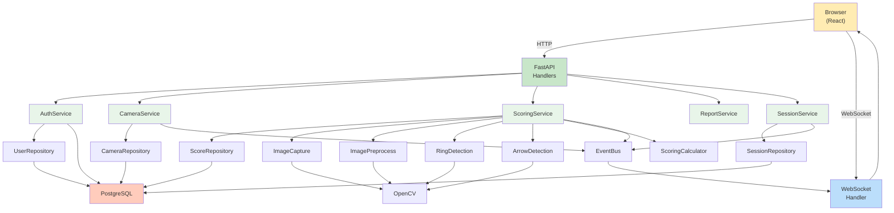

# Application Design — Consolidated

**Project**: Automated Archery Scoring System  
**Phase**: INCEPTION - Application Design Complete  
**Date**: 2026-05-23  

---

## Executive Summary

The application is designed using **Feature-Based Organization** with **Functional Services** (~8 services). Components are organized by feature area (Authentication, Cameras, Sessions, Scoring, Reports, etc.) with a clear **Repository Pattern** for data access and **Event-Driven** communication via EventBus for real-time updates.

### Key Design Decisions

| Decision | Choice | Rationale |
|---|---|---|
| **Component Organization** | Feature-Based | Aligns with story structure; enables parallel team work (Frontend + Backend) |
| **Service Layer** | ~8 Functional Services | Clear boundaries by feature; prevents monolithic orchestrator |
| **API Routes** | Feature-Based Routers | Organized by feature area (auth.py, sessions.py, scoring.py, etc.) |
| **Authentication** | Central AuthService | Centralized JWT management; consistent token handling |
| **Scoring Pipeline** | Hybrid (Service + Components) | Service orchestrates; delegates to specialized components for each stage |
| **Permissions** | Role-Based Decorators + FastAPI Depends | Built into framework; minimal boilerplate |
| **Reporting** | Report Generators (Strategy Pattern) | Easy to add new formats; pluggable architecture |
| **Real-Time Communication** | Event-Driven + WebSocket | Services publish events; WebSocket subscribes; loose coupling |
| **Data Access** | Repository Pattern | Clear data layer; easy to test; swappable persistence |
| **Error Handling** | Service Layer Exceptions | Services throw domain exceptions; handlers convert to HTTP |
| **Async Communication** | Hybrid (Sync HTTP + Async WebSocket) | Critical path synchronous; heavy work uses threads internally |
| **Multi-Camera** | Thread Pool (4 workers) | Parallel processing; synchronous response after completion |
| **Session State** | Database-Backed | Persistent state in DB; survives server restarts |
| **Camera Preview** | Hybrid (Push + Pull) | Push-based streaming (15 fps); clients can pull specific frames |
| **Component Coupling** | Moderately Coupled | Pragmatic: tight where needed (performance); loose elsewhere (flexibility) |

---

## Architecture Layers

```
┌─────────────────────────────────────────────────────────────┐
│                    HTTP API Layer                            │
│  Handlers: Auth, Camera, Tournament, Session, Scoring, etc.  │
│  Middlewares: Authentication, Authorization, Logging         │
│  WebSocket: Real-time score broadcasts, camera preview       │
└─────────────────────────────────────────────────────────────┘
                              ↓
┌─────────────────────────────────────────────────────────────┐
│                    Service Layer                             │
│  AuthService, CameraService, ScoringService, etc.            │
│  Orchestrate business logic                                 │
│  Publish/Subscribe via EventBus                             │
└─────────────────────────────────────────────────────────────┘
                              ↓
┌─────────────────────────────────────────────────────────────┐
│              Components & Specialized Logic                  │
│  Repositories, ImageProcessing, Generators, Managers         │
│  Implement specific functionality                           │
└─────────────────────────────────────────────────────────────┘
                              ↓
┌─────────────────────────────────────────────────────────────┐
│                Data & External Layer                         │
│  PostgreSQL, OpenCV, WeasyPrint, FastAPI/Uvicorn            │
└─────────────────────────────────────────────────────────────┘
```

---

## Component Summary

### Domain Models (8)
- **User** — Authentication and role information
- **Camera** — Physical/virtual camera representation
- **Tournament** — Competitive event
- **Session** — Single round within tournament
- **SessionArcher** — Archer participation in session
- **Score** — Individual arrow score
- **ReportData** — Aggregated score data for reports
- **DomainEvent** — Base for event-driven communication

### Services (8)
- **AuthService** — JWT authentication, token management
- **CameraService** — USB/RTSP camera enumeration and configuration
- **TournamentService** — Tournament lifecycle
- **SessionService** — Session orchestration and state management
- **ScoringService** — Image processing pipeline orchestration (main business logic)
- **ReportService** — Report generation and query
- **EventBus** — Event publishing and subscription
- **WebSocketService** — Real-time connection management

### Repositories (5)
- **UserRepository** — User data access
- **CameraRepository** — Camera configuration storage
- **TournamentRepository** — Tournament data
- **SessionRepository** — Session data
- **ScoreRepository** — Score records and audit trail

### API Handlers (6)
- **AuthHandlers** — Login, logout, token endpoints
- **CameraHandlers** — Camera enumeration, configuration, status
- **TournamentHandlers** — Create, list, update tournaments
- **SessionHandlers** — Create, manage sessions and archer registration
- **ScoringHandlers** — Trigger scoring, override scores
- **ReportHandlers** — Generate reports and leaderboards

### Specialized Components (7+)
- **ImageCaptureComponent** — Camera frame capture and burst mode
- **ImagePreprocessComponent** — Image normalization and filtering
- **RingDetectionComponent** — Target ring detection via OpenCV
- **ArrowDetectionComponent** — Arrow localization and confidence
- **ScoringCalculatorComponent** — Zone-to-score mapping
- **Report Generators** — PDF, CSV, JSON formatting
- **WebSocketConnectionManager** — Connection registry and broadcasting

### Infrastructure (4)
- **AuthorizationMiddleware** — Token extraction and validation
- **PermissionCheckDecorator** — Role-based access control decorator
- **CameraManager** — USB probe and auto-reconnect logic
- **CameraDisconnectHandler** — Disconnection recovery

### Total: ~40 distinct components

---

## Communication Patterns

### 1. Synchronous Request/Response (HTTP)
Default for most operations. Caller waits for service to complete.

**Examples**:
- Authentication: `POST /auth/login` → 50-100ms response
- Camera config: `PUT /cameras/{id}` → 10-50ms response
- Session setup: `POST /sessions` → 50-100ms response

### 2. Synchronous with Event Publication
Service completes, publishes event, returns response. EventBus routes to WebSocket independently.

**Examples**:
- Scoring: `POST /scoring/calculate` → 500-1000ms response + event published
- Session start: `POST /sessions/{id}/start` → 100ms response + event published

**Event Flow**:
```
HTTP Response (immediate)
  ↓
EventBus.publish()
  ↓
WebSocket subscribers (< 100ms)
  ↓
Clients receive broadcast
```

### 3. Asynchronous Background Tasks
Long-running tasks (camera probing, reconnection) run independently.

**Examples**:
- Camera probing: every 30 seconds
- Reconnection attempts: staggered retries

### 4. Event-Driven with Loose Coupling
Services publish events; subscribers process independently.

**Examples**:
- `ScoreCalculated` → WebSocket publishes, AuditLogger logs
- `CameraDisconnected` → WebSocket publishes, CameraDisconnectHandler retries
- `SessionStarted` → WebSocket publishes

### 5. Thread Pool for Parallelism
ScoringService uses ThreadPool to process multiple cameras concurrently.

**Configuration**:
- `max_workers=4` (supports 4+ simultaneous cameras)
- Each thread processes: Capture → Preprocess → Detect → Calculate
- Main thread waits for all threads to complete before returning

---

## Data Persistence

### Database Schema (PostgreSQL)

**Tables**:
- `users` — Authentication and roles
- `cameras` — Camera configuration and status
- `tournaments` — Tournament metadata
- `sessions` — Session configuration and state
- `session_archers` — Archer participation
- `scores` — Individual arrow scores + audit trail
- `audit_logs` — User actions and system events

**Key Constraints**:
- Cascade deletes (session → scores)
- Unique constraints (username, camera name)
- Foreign keys for referential integrity

**Transactions**:
- Score creation is atomic (all 3 arrows or none)
- Session state transitions use explicit status column
- Audit trail via immutable score records

---

## Security Architecture

### Authentication
- JWT tokens with 8-hour expiration
- HttpOnly cookies (prevents JavaScript access)
- Token stored securely; refresh tokens separate
- Password hashed with bcrypt

### Authorization
- **4-Role RBAC**:
  - SYSTEM_ADMIN — User management, system configuration
  - TOURNAMENT_ADMIN — Tournament creation, session management
  - SCORER — Image capture and scoring
  - ARCHER — View own scores only

- **Object-Level Permissions**:
  - Archer can only access own scores
  - Enforced at repository query level (WHERE archer_id = current_user)

### Decorators & Middleware
- `@require_role(TOURNAMENT_ADMIN)` — Restrict endpoints
- `AuthorizationMiddleware` — Extract user from JWT
- Permission checks in query construction

---

## Performance Targets

### Scoring (Primary)
- **Target**: < 1 second end-to-end
- **Breakdown**:
  - Capture: 200ms
  - Preprocess: 300ms
  - Ring Detect: 200ms
  - Arrow Detect: 150ms
  - Score Calc: 50ms

### Live Preview
- **Target**: 15 fps (66ms per frame)
- **Implementation**: Hybrid (push-based streaming)
- **Codec**: MJPEG over WebSocket

### Concurrent Cameras
- **Target**: 4+ simultaneous captures
- **Implementation**: ThreadPool with 4 workers
- **No blocking**: Each camera independent

### Real-Time Broadcasts
- **Target**: < 100ms score update delivery
- **Implementation**: Event-driven WebSocket
- **Guarantee**: Immediate publish after database commit

---

## Error Handling Strategy

### Service Layer (Throws Exceptions)
```python
raise AuthenticationError("Invalid credentials")
raise TokenInvalidError("Token expired")
raise CameraError("Camera not connected")
raise DetectionError("Rings not detected")
raise ScoringError("Image processing failed")
raise ValidationError("Business rule violated")
raise UnauthorizedError("User lacks permission")
```

### Handler Layer (Catches & Converts)
```python
try:
    result = service.method()
except AuthenticationError:
    return JSONResponse({"error": "..."}, status_code=401)
except UnauthorizedError:
    return JSONResponse({"error": "..."}, status_code=403)
except ValidationError:
    return JSONResponse({"error": "..."}, status_code=400)
except Exception:
    return JSONResponse({"error": "..."}, status_code=500)
```

### WebSocket (Graceful Degradation)
- Silent disconnection handling
- No exception propagation to other clients
- Automatic cleanup of stale connections

---

## Deployment & Infrastructure

### Containerization
- **Docker Image** — FastAPI app + dependencies
- **Compose File** — FastAPI backend + PostgreSQL database
- **Local Storage** — `/storage/raw/`, `/storage/annotated/`

### Networking
- **Backend**: Uvicorn (port 8000)
- **Database**: PostgreSQL (port 5432)
- **WebSocket**: Built-in to FastAPI
- **Reverse Proxy**: Nginx (production)

### Performance Tuning
- Connection pooling (PostgreSQL)
- Request/response compression
- Static asset caching
- WebSocket connection limits

---

## Testing Strategy

### Unit Tests (Repository)
- Test data access layer
- Mock database
- Verify query correctness

### Integration Tests (Service)
- Test service logic
- Use test database
- Verify repository interactions

### E2E Tests (Handler)
- Test HTTP endpoints
- Real database
- Full request/response cycle

### Performance Tests
- Load test scoring pipeline
- Verify < 1s target
- Multi-camera concurrent testing

---

## Scalability & Extensibility

### Adding New Features
**New Report Format**:
1. Create `NewFormatReportGenerator` (extends ReportGenerator)
2. Add method to `ReportService`
3. Add route in `ReportHandlers`

**New Detection Method**:
1. Create `NewDetectionComponent`
2. Add to `ScoringService.score_end()` pipeline
3. No other changes needed

**New User Role**:
1. Add to Role enum
2. Add permissions to `PermissionCheckDecorator`
3. Update routes as needed

### Constraints
- Single event scale (4-6 users, 4 cameras)
- Synchronous scoring (no job queue)
- Local filesystem (no object storage)
- In-process EventBus (no message broker)

---

## Architecture Diagram



---

## References

- **Components**: See [components.md](components.md)
- **Methods**: See [component-methods.md](component-methods.md)
- **Services**: See [services.md](services.md)
- **Dependencies**: See [component-dependency.md](component-dependency.md)

---

## Next Steps

### Immediate
1. ✅ Application Design Complete
2. ⏳ Units Planning (identify specific implementation units)
3. ⏳ Units Generation (detail each unit's inputs/outputs)

### During Construction (CONSTRUCTION Phase)
4. Functional Design (per-unit) — Scoring algorithm, validation rules, business logic
5. NFR Requirements (per-unit) — Performance targets, security rules, scalability
6. NFR Design (per-unit) — WebSocket architecture, async processing, caching
7. Infrastructure Design (per-unit) — Database schema, Docker setup, build config
8. Code Generation (per-unit) — Implement Backend and Frontend
9. Build and Test — Integration, performance, security

---

**Design Status**: ✅ COMPLETE  
**Team Impact**: Clear architecture for independent Frontend and Backend teams  
**Ready for**: Units Planning and Code Generation phases

