# Execution Plan — Archery Scoring System

**Project**: Automated Archery Scoring System — Web Application  
**Date**: 2026-05-23  
**Phase**: INCEPTION - Workflow Planning  
**Document Status**: Ready for Approval  

---

## 1. Detailed Analysis Summary

### Change Impact Assessment

| Category | Impact | Notes |
|---|---|---|
| **User-facing changes** | ✅ YES | Complete new application for 4 user roles (Admin, Tournament Admin, Scorer, Archer) |
| **Structural changes** | ✅ YES | New system architecture: Frontend + Backend + Database + WebSocket services |
| **Data model changes** | ✅ YES | New domain models: Tournaments, Sessions, Archers, Scores, Annotations, Audit trails |
| **API changes** | ✅ YES | 20+ REST endpoints + WebSocket server required |
| **NFR impact** | ✅ YES | Critical: Performance (< 1s scoring), Security (11 rules), Scalability (4+ cameras) |

### Scope Characteristics

| Characteristic | Value | Implications |
|---|---|---|
| **Project Type** | Greenfield | No legacy code integration required; can optimize architecture from scratch |
| **Team Structure** | Paired Senior Developers | 2 independent tracks (Frontend + Backend) enable parallel development |
| **Technology Stack** | Locked | No stack evaluation needed; proceed with FastAPI + React + PostgreSQL + OpenCV |
| **Delivery Approach** | Full-Featured First Release | 18 Phase 1 stories + 3 Phase 2 stories; no MVP constraint |
| **Extensions** | Both Enabled | Security (11 rules) + PBT (9 rules) are mandatory blocking constraints |
| **Deployment Model** | LAN-Based Docker | Containerized app; no cloud vendor lock-in; local filesystem for media |
| **Scale** | Single Event | 4-6 concurrent users, 4 cameras, 100-200 records per session |

### Risk Assessment

| Factor | Level | Rationale |
|---|---|---|
| **Technical Complexity** | MEDIUM | Image processing is complex but isolated; architecture is straightforward |
| **Integration Complexity** | LOW | Clear Frontend-Backend separation; WebSocket integration well-defined |
| **Timeline Risk** | MEDIUM | 2-4 week estimate is aggressive; depends on image processing tuning |
| **Team Risk** | LOW | Senior developers with specified tech stacks; clear role separation |
| **Data/Security Risk** | MEDIUM | Permission-based access control must be strict; audit trail is mandatory |
| **Rollback Complexity** | LOW | Greenfield project; no legacy migration; can restart from scratch if needed |

**Overall Risk Level**: **MEDIUM** — Complexity is moderate; mitigated by greenfield advantages and clear requirements

---

## 2. Architecture Overview

```
┌─────────────────────────────────────────────────────────┐
│                     BROWSER (Client)                     │
│  ┌──────────────────────────────────────────────────────┐│
│  │  React App (TypeScript + Vite)                        ││
│  │  ├─ UI Pages (Login, Scoring, Reports, Admin)       ││
│  │  ├─ Real-time Updates (WebSocket)                    ││
│  │  ├─ Live Camera Preview (15 fps MJPEG)              ││
│  │  └─ State Management (Zustand)                       ││
│  └──────────────────────────────────────────────────────┘│
│                         │                                 │
│                  HTTP + WebSocket                         │
│                         │                                 │
└─────────────────────────────────────────────────────────┘
                         │
        ┌────────────────┴────────────────┐
        │                                 │
┌───────▼────────────┐        ┌──────────▼──────────┐
│  FastAPI Backend   │        │  PostgreSQL DB      │
│  (Python 3.11+)   │        │  (Production)        │
│  ├─ Auth API       │        │  ├─ Users/Roles     │
│  ├─ Scoring API    │        │  ├─ Tournaments     │
│  ├─ Report API     │        │  ├─ Sessions        │
│  ├─ Admin API      │        │  ├─ Scores/Audits   │
│  ├─ WebSocket Srv  │        │  └─ Archer Data     │
│  └─ Image Proc     │        └─────────────────────┘
│     (OpenCV)       │
│     (FastAPI BG)   │
└───────┬────────────┘
        │
    ┌───┴────────────────────┐
    │                        │
┌───▼────────────┐  ┌────────▼──────────┐
│  USB Cameras   │  │ RTSP/HTTP Streams │
│  via OpenCV    │  │  (IP Cameras)     │
└────────────────┘  └───────────────────┘
```

### Component Dependencies

```
AUTHENTICATION (USR-001)
    ↓ (blocks all features)
┌─────────────────────────────────────────────┐
│                                             │
├─→ USER MANAGEMENT (USR-002, USR-003)       │
├─→ CAMERA MANAGEMENT (CAM-001 → CAM-003)    │
├─→ TOURNAMENT/SESSION (SES-001 → SES-004)   │
│   └─→ ARCHER REGISTRATION (SES-003)        │
├─→ SCORING (SCORE-001 → SCORE-003)          │
│   └─→ LOW CONFIDENCE (SCORE-OV-001 → 004) │
├─→ PERMISSIONS (PERM-001, PERM-002)         │
├─→ REPORTS (RPT-001, RPT-002)               │
├─→ REAL-TIME (RT-001 → RT-002)              │
├─→ ERROR RECOVERY (ERR-001 → ERR-002)       │
├─→ PERFORMANCE (PERF-001, PERF-002)         │
└─→ DATA RETENTION (DATA-001)                │
```

---

## 3. Execution Strategy

### Phases to EXECUTE (6 stages)

| Phase | Reason | Depth |
|---|---|---|
| **1. Application Design** | New system requires component design, service layer definition, and API contracts | STANDARD |
| **2. Units Planning** | Identify parallel work units (Frontend vs Backend) for team coordination | STANDARD |
| **3. Units Generation** | Create detailed unit specifications (scope, inputs, outputs, success criteria) | STANDARD |
| **4. Functional Design** | Design scoring algorithm, data models, permissions, business logic | STANDARD (per-unit) |
| **5. NFR Requirements** | Define performance targets, security rules, scalability, storage constraints | STANDARD (per-unit) |
| **6. NFR Design** | Design WebSocket architecture, caching, async processing, monitoring | STANDARD (per-unit) |
| **7. Infrastructure Design** | Docker containerization, database design, deployment model, storage | STANDARD (per-unit) |
| **8. Code Generation** | Implement all code artifacts based on designs (Planning + Generation phases) | STANDARD (per-unit) |
| **9. Build and Test** | Build, unit test, integration test, performance test, security test | STANDARD |

### Phases to SKIP (1 stage)

| Phase | Reason |
|---|---|
| **Reverse Engineering** | Greenfield project — no legacy code to analyze |

### Phases Already COMPLETED (4 stages)

| Phase | Status |
|---|---|
| **Workspace Detection** | ✅ Greenfield confirmed |
| **Requirements Analysis** | ✅ 405-line comprehensive document, 20 questions answered |
| **User Stories** | ✅ 21 stories (18 Phase 1, 3 Phase 2), 84 acceptance criteria, 4 personas |
| **Workflow Planning** | ✅ Execution plan created (this document) |

---

## 4. Unit Decomposition

### Unit 1: Backend (Python/FastAPI)

**Scope**: API server, image processing, database, authentication, WebSocket server  
**Technology**: Python 3.11+, FastAPI, PostgreSQL, OpenCV, structlog, SQLAlchemy  
**Team**: Senior Backend Developer Agent  
**Outputs**:
- REST API (20+ endpoints)
- WebSocket server (real-time updates)
- Image processing pipeline (4+ detection methods)
- Database schema and migrations
- Authentication/Authorization system
- Error handling and logging

**Key Stories**: All backend stories (CAM-001, SES-001, SCORE-001, RPT-001, RT-001, ERR-001, PERF-001, etc.)

### Unit 2: Frontend (React/TypeScript)

**Scope**: Web UI, client-side state, real-time updates, camera preview  
**Technology**: React 18+, TypeScript 5+, Vite, Zustand, Tailwind CSS, shadcn/ui, Recharts, Axios  
**Team**: Senior Frontend Developer Agent  
**Outputs**:
- Authentication pages (Login, logout)
- Admin dashboard (user management, camera config)
- Tournament/Session management pages
- Scoring interface (live preview, results, override)
- Reports and leaderboard pages
- Responsive mobile UI for scorers

**Key Stories**: All frontend stories (USR-001, CAM-003, SES-001, SCORE-002, RPT-002, RT-002, etc.)

---

## 5. Design and Implementation Timeline

### 🔵 INCEPTION PHASE (Planning) — **~3 hours**

| Stage | Duration | Deliverables |
|---|---|---|
| Application Design | 45 min | Component architecture, service layer, API contracts |
| Units Planning | 30 min | Unit specifications, team assignments |
| Units Generation | 30 min | Detailed unit scopes, dependencies, success criteria |

### 🟢 CONSTRUCTION PHASE (Implementation) — **~10-14 days**

#### Per-Unit Track (Parallel Execution)

**UNIT 1: Backend** — ~6-8 days
| Stage | Duration | Deliverables |
|---|---|---|
| Functional Design | 4-6 hours | Scoring algorithm, data models, business logic |
| NFR Requirements | 2-3 hours | Performance targets, security checklist, scalability plan |
| NFR Design | 3-4 hours | WebSocket architecture, async processing, caching strategy |
| Infrastructure Design | 2-3 hours | Database schema, Docker setup, API gateway config |
| Code Generation (Planning) | 2-3 hours | Implementation checklist, code structure |
| Code Generation (Execution) | 4-5 days | API implementation, image processing, database layer |

**UNIT 2: Frontend** — ~4-6 days
| Stage | Duration | Deliverables |
|---|---|---|
| Functional Design | 2-3 hours | UI mockups, component hierarchy, state management |
| NFR Requirements | 1-2 hours | Performance targets, browser compatibility, accessibility |
| NFR Design | 2-3 hours | Client-side caching, error handling, offline capability |
| Infrastructure Design | 1-2 hours | Build config (Vite), deployment strategy, asset optimization |
| Code Generation (Planning) | 1-2 hours | Implementation checklist, component structure |
| Code Generation (Execution) | 3-4 days | UI implementation, integration with backend API |

#### Sequential After Units Complete
| Stage | Duration | Deliverables |
|---|---|---|
| **Build and Test** | 1-2 days | Build scripts, test suites, performance validation, security scanning |

### 🟡 OPERATIONS PHASE — **PLACEHOLDER** (Future)

---

## 6. Team Collaboration Points

**Before Starting**:
- ✅ Approve Application Design (API contracts, data models)
- ✅ Approve Units specifications (scope, inputs/outputs)

**During Units**:
- API Contract Review (Backend creates; Frontend verifies)
- WebSocket Event Schema agreement (Backend defines; Frontend consumes)
- Database schema agreement (ensure Frontend queries align)

**After Units**:
- Integration testing (both teams validate API integration)
- Performance testing (verify targets met: < 1s scoring, 15 fps preview)
- Security testing (verify all 11 security rules enforced)

---

## 7. Workflow Visualization

```mermaid
flowchart TD
    Start(["User Request"])
    
    subgraph INCEPTION["🔵 INCEPTION PHASE"]
        WD["Workspace Detection<br/><b>✅ COMPLETED</b>"]
        RA["Requirements Analysis<br/><b>✅ COMPLETED</b>"]
        US["User Stories<br/><b>✅ COMPLETED</b>"]
        WP["Workflow Planning<br/><b>✅ COMPLETED</b>"]
        AD["Application Design<br/><b>⏳ EXECUTE</b>"]
        UP["Units Planning<br/><b>⏳ EXECUTE</b>"]
        UG["Units Generation<br/><b>⏳ EXECUTE</b>"]
    end
    
    subgraph UNIT_BACKEND["🔧 UNIT: Backend (Python/FastAPI)"]
        FD_BE["Functional Design<br/><b>⏳ EXECUTE</b>"]
        NFRA_BE["NFR Requirements<br/><b>⏳ EXECUTE</b>"]
        NFRD_BE["NFR Design<br/><b>⏳ EXECUTE</b>"]
        ID_BE["Infrastructure Design<br/><b>⏳ EXECUTE</b>"]
        CG_BE["Code Generation<br/><b>⏳ EXECUTE</b>"]
    end
    
    subgraph UNIT_FRONTEND["🎨 UNIT: Frontend (React/TypeScript)"]
        FD_FE["Functional Design<br/><b>⏳ EXECUTE</b>"]
        NFRA_FE["NFR Requirements<br/><b>⏳ EXECUTE</b>"]
        NFRD_FE["NFR Design<br/><b>⏳ EXECUTE</b>"]
        ID_FE["Infrastructure Design<br/><b>⏳ EXECUTE</b>"]
        CG_FE["Code Generation<br/><b>⏳ EXECUTE</b>"]
    end
    
    subgraph FINAL["🟢 CONSTRUCTION PHASE (Sequential)"]
        BT["Build and Test<br/><b>✅ EXECUTE</b>"]
    end
    
    subgraph OPS["🟡 OPERATIONS PHASE"]
        PH["Placeholder (Future)<br/><b>SKIP</b>"]
    end
    
    Start --> WD
    WD --> RA
    RA --> US
    US --> WP
    WP --> AD
    AD --> UP
    UP --> UG
    
    UG --> FD_BE
    UG --> FD_FE
    
    FD_BE --> NFRA_BE --> NFRD_BE --> ID_BE --> CG_BE
    FD_FE --> NFRA_FE --> NFRD_FE --> ID_FE --> CG_FE
    
    CG_BE --> BT
    CG_FE --> BT
    
    BT --> End(["Release Ready"])
    BT -.-> PH
    
    style Start fill:#CE93D8,stroke:#6A1B9A,stroke-width:3px,color:#000
    style End fill:#CE93D8,stroke:#6A1B9A,stroke-width:3px,color:#000
    
    style WD fill:#4CAF50,stroke:#1B5E20,stroke-width:3px,color:#fff
    style RA fill:#4CAF50,stroke:#1B5E20,stroke-width:3px,color:#fff
    style US fill:#4CAF50,stroke:#1B5E20,stroke-width:3px,color:#fff
    style WP fill:#4CAF50,stroke:#1B5E20,stroke-width:3px,color:#fff
    
    style AD fill:#FFA726,stroke:#E65100,stroke-width:3px,stroke-dasharray: 5 5,color:#000
    style UP fill:#FFA726,stroke:#E65100,stroke-width:3px,stroke-dasharray: 5 5,color:#000
    style UG fill:#FFA726,stroke:#E65100,stroke-width:3px,stroke-dasharray: 5 5,color:#000
    
    style FD_BE fill:#FFA726,stroke:#E65100,stroke-width:3px,stroke-dasharray: 5 5,color:#000
    style NFRA_BE fill:#FFA726,stroke:#E65100,stroke-width:3px,stroke-dasharray: 5 5,color:#000
    style NFRD_BE fill:#FFA726,stroke:#E65100,stroke-width:3px,stroke-dasharray: 5 5,color:#000
    style ID_BE fill:#FFA726,stroke:#E65100,stroke-width:3px,stroke-dasharray: 5 5,color:#000
    style CG_BE fill:#FFA726,stroke:#E65100,stroke-width:3px,stroke-dasharray: 5 5,color:#000
    
    style FD_FE fill:#FFA726,stroke:#E65100,stroke-width:3px,stroke-dasharray: 5 5,color:#000
    style NFRA_FE fill:#FFA726,stroke:#E65100,stroke-width:3px,stroke-dasharray: 5 5,color:#000
    style NFRD_FE fill:#FFA726,stroke:#E65100,stroke-width:3px,stroke-dasharray: 5 5,color:#000
    style ID_FE fill:#FFA726,stroke:#E65100,stroke-width:3px,stroke-dasharray: 5 5,color:#000
    style CG_FE fill:#FFA726,stroke:#E65100,stroke-width:3px,stroke-dasharray: 5 5,color:#000
    
    style BT fill:#4CAF50,stroke:#1B5E20,stroke-width:3px,color:#fff
    style PH fill:#BDBDBD,stroke:#424242,stroke-width:2px,stroke-dasharray: 5 5,color:#000
    
    style INCEPTION fill:#BBDEFB,stroke:#01579B,stroke-width:2px,color:#000
    style UNIT_BACKEND fill:#C8E6C9,stroke:#1B5E20,stroke-width:2px,color:#000
    style UNIT_FRONTEND fill:#FFECB3,stroke:#F57F17,stroke-width:2px,color:#000
    style FINAL fill:#C8E6C9,stroke:#1B5E20,stroke-width:2px,color:#000
    style OPS fill:#FFF59D,stroke:#F57F17,stroke-width:2px,color:#000
    
    linkStyle default stroke:#333,stroke-width:2px
```



---

## 8. Success Criteria

### Phase Completion Gates

| Gate | Criteria | Success Definition |
|---|---|---|
| **Application Design** | API contracts defined, component architecture approved, service layer clear | All 20+ endpoints specified, data models locked, team agrees |
| **Units Planning** | Unit scopes clear, team assignments confirmed, inputs/outputs defined | Backend + Frontend scopes non-overlapping, dependencies documented |
| **Units Generation** | Unit specifications detailed, success criteria measurable | Each unit has clear inputs, outputs, constraints, and acceptance criteria |
| **Code Generation (Each Unit)** | Implementation complete, code reviewed, tests passing | All user stories implemented, performance targets verified, code review passed |
| **Build and Test** | Full system builds, all tests passing, performance targets met | Build succeeds, unit tests ✅, integration tests ✅, performance tests ✅, security scan ✅ |

### Quality Thresholds

| Category | Target | Validation |
|---|---|---|
| **Test Coverage** | 60-70% | Backend unit tests, Frontend component tests |
| **Performance** | < 1s scoring, 15 fps preview | Load testing confirms targets |
| **Security** | All 11 rules enforced | Security audit, penetration testing |
| **Property-Based Testing** | All 9 rules implemented | Hypothesis tests for critical algorithms |
| **Code Quality** | No critical issues | Linting passes, type checking passes (mypy + TypeScript) |

---

## 9. Risk Mitigation

| Risk | Mitigation Strategy |
|---|---|
| **Image processing performance** | Early prototype and performance testing; if < 1s target cannot be met, reduce detection complexity in Phase 2 |
| **Real-time concurrency issues** | WebSocket testing under load; async pattern validation early |
| **Permission enforcement gaps** | Security-first code review; penetration testing before release |
| **Team coordination delays** | Weekly sync meetings; API contract review before coding starts |
| **Database scaling issues** | PostgreSQL optimization, index planning during schema design |

---

## 10. Recommended Execution Order

### ✅ Next Steps (IMMEDIATE)

1. **Approve execution plan** (this document)
2. **Execute Application Design** → Define component architecture and API contracts
3. **Execute Units Planning** → Formalize Frontend/Backend unit scopes

### 🟠 Phase 1 Execution (UNIT WORK)

**Parallel Tracks** (Frontend Agent & Backend Agent work independently):

- **Backend Track**: Functional Design → NFR Requirements → NFR Design → Infrastructure Design → Code Generation
- **Frontend Track**: Functional Design → NFR Requirements → NFR Design → Infrastructure Design → Code Generation

### 🟢 Phase 2 Execution (INTEGRATION)

- **Build and Test**: Integration testing, performance validation, security verification

---

## 11. Estimated Timeline

| Phase | Duration | Notes |
|---|---|---|
| **Planning (Inception)** | ~3 hours | Application Design + Units Planning + Units Generation |
| **Backend Development** | ~4-5 days | Parallel with Frontend |
| **Frontend Development** | ~3-4 days | Parallel with Backend |
| **Build and Test** | ~1-2 days | After both units complete |
| **Total Estimate** | **~2-3 weeks** | Moderate pace, inclusive of reviews |

**Contingency**: Add 2-3 additional days if image processing performance tuning needed

---

## Key Decisions Documented

✅ **Team Structure**: Senior Backend Developer Agent + Senior Frontend Developer Agent (independent parallel tracks)  
✅ **Technology Stack**: Locked (FastAPI, React, PostgreSQL, OpenCV, Zustand, Docker)  
✅ **Deployment**: LAN-based Docker containers, local filesystem for media  
✅ **Scale**: Single event, 4-6 concurrent users, 4 cameras, PostgreSQL  
✅ **Security**: All 11 rules MANDATORY  
✅ **Testing**: PBT all 9 rules MANDATORY + standard 60-70% coverage  
✅ **Phases**: Complete first release (18 Phase 1 + 3 Phase 2 stories)  

---

**Ready to proceed with execution plan? ✅**

