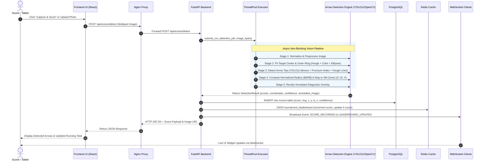
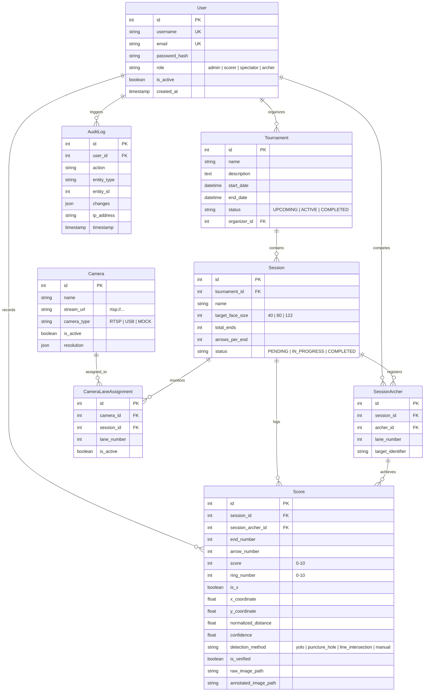

# System Architecture — Automated Archery Scoring System (SPL-3)

**Lifecycle Stage**: Inception / Reverse Engineering  
**Standard**: AIDLC Process Guidelines (`inception/reverse-engineering.md`)  
**Topology**: Containerized Microservices Stack (Docker Compose)

---

## 1. System Overview

The system is engineered as a modern, decoupled client-server platform optimized for high-performance image processing, sub-second scoring latency, and real-time event streaming across local-area network (LAN) shooting ranges.

```mermaid
graph TB
    subgraph Client_Tier["Client Presentation Tier"]
        Browser["Modern Web Browsers (Chrome / Firefox / Safari)"]
        Tablet["Range Scorer Tablets (Touch-optimized)"]
    end

    subgraph Ingress_Tier["Ingress & Static Serving Tier (Port 3000 / 5173)"]
        NginxProxy["Nginx Reverse Proxy & SPA Host<br/>- Serves Vite React distribution<br/>- Proxies /api/ to FastAPI<br/>- Upgrades /api/ws/ to WebSockets"]
    end

    subgraph Application_Tier["Application & AI Processing Tier (Port 8000)"]
        FastAPI["FastAPI ASGI Application<br/>- Security Middleware (JWT, Rate Limiting, CORS)<br/>- 9 REST API Routers<br/>- 2 WebSocket Endpoints"]
        ThreadPool["Adaptive ThreadPoolExecutor<br/>- Sized 4–8 workers<br/>- Offloads heavy CPU-bound CV tasks"]
        
        subgraph Detection_Engine["Hybrid ML/CV Vision Engine"]
            YOLO["Ultralytics YOLO11 Neural Network<br/>(best.pt weights, mAP50=97.8%)"]
            OpenCV["OpenCV Multi-Method Pipeline<br/>(Hough, Color Bands, Contour Ellipses, Puncture Holes)"]
        end
    end

    subgraph Persistence_Tier["Persistence & In-Memory Data Tier"]
        Postgres["PostgreSQL 15 Database (Port 5432)<br/>- Relational storage for users, tournaments, sessions, scores, cameras, audits"]
        Redis["Redis 7 In-Memory Cache (Port 6379)<br/>- Sorted sets for instant leaderboard ranks<br/>- Event bus messaging"]
        FileStorage["Docker Volume: /storage<br/>- /storage/raw: Original camera captures<br/>- /storage/annotated: Diagnostic overlays<br/>- /storage/reports: Generated PDF/CSV match cards"]
    end

    Browser -->|HTTP & WebSockets| NginxProxy
    Tablet -->|HTTP & WebSockets| NginxProxy
    NginxProxy -->|HTTP REST: /api/| FastAPI
    NginxProxy -->|WS Upgrade: /api/ws/| FastAPI
    FastAPI -->|Offload image compute| ThreadPool
    ThreadPool --> Detection_Engine
    FastAPI -->|SQLAlchemy ORM (QueuePool)| Postgres
    FastAPI -->|Sorted Sets & Caching| Redis
    FastAPI -->|Persist images & reports| FileStorage
```

---

## 2. End-to-End Scoring Data Flow

The following sequence diagram captures the core business loop: capturing an arrow impact, running hybrid YOLO11/OpenCV inference, persisting the score, updating leaderboards, and broadcasting real-time updates to all connected displays.



---

## 3. Database Entity-Relationship Architecture

The relational schema is normalized in third normal form (3NF) and managed via SQLAlchemy ORM models:



---

## 4. Integration Points & Protocols

| Integration Boundary | Protocol / Driver | Serialization | Purpose |
|---|---|---|---|
| **Frontend $\leftrightarrow$ Nginx** | HTTP/1.1 & WebSocket | HTML / JS / JSON / Binary Blob | Static application delivery and single endpoint ingress. |
| **Nginx $\leftrightarrow$ FastAPI** | HTTP/1.1 (Reverse Proxy) | REST JSON & WebSocket Frames | Forwards `/api/*` and `/api/ws/*` traffic to backend services. |
| **FastAPI $\leftrightarrow$ PostgreSQL** | TCP / `psycopg2-binary` | SQL Queries & Binary Protocol | ACID transactional persistence for tournament, scoring, and user state. |
| **FastAPI $\leftrightarrow$ Redis** | TCP / `redis-py` (async/sync) | In-Memory Key-Value & Sorted Sets | Fast leaderboard aggregation, cache TTL invalidation, event pub/sub. |
| **FastAPI $\leftrightarrow$ RTSP Cameras** | RTSP / OpenCV VideoCapture | H.264 / MJPEG Video Frames | Pulls live video frames from on-range target cameras for live preview and scoring. |
| **FastAPI $\leftrightarrow$ Storage Volume** | POSIX Filesystem | JPEG Images & PDF/CSV Files | Local storage volume for raw photos, annotated crops, and generated reports. |

---

## 5. Security & Isolation Architecture

1. **Role-Based Access Control (RBAC)**:
   - Enforced through FastAPI route dependencies (`get_current_user`, `require_role`).
   - Four distinct permission tiers:
     - `admin`: Full administrative access (user management, tournament deletion, hardware configuration).
     - `scorer`: Tournament scoring operations, camera previews, score approvals, end completion.
     - `archer`: Personal scorecard viewing, history retrieval.
     - `spectator`: Read-only access to leaderboards and active session broadcasts.
2. **Network Isolation**:
   - Internal services (`db`, `cache`, `api`) communicate across the dedicated Docker bridge network `archery_network`.
   - Only HTTP port 3000/5173 (Frontend/Nginx) and port 8000 (Backend API) are published to the host machine.
   - Nginx handles ingress sanitization and CORS header resolution.
