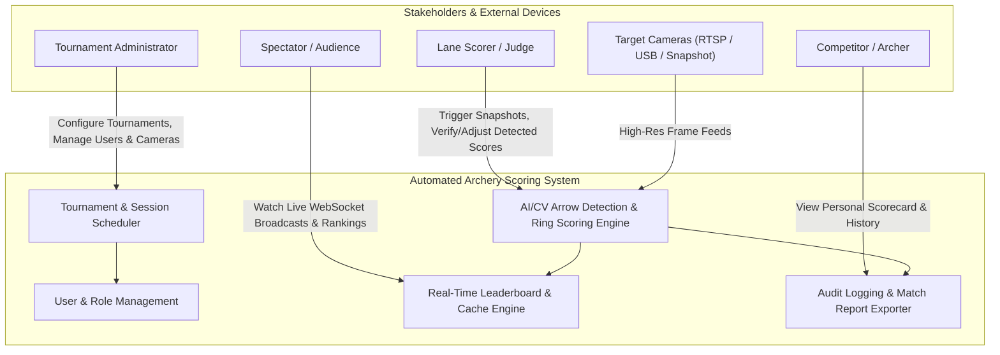

# Business Overview — Automated Archery Scoring System (SPL-3)

**Lifecycle Stage**: Inception / Reverse Engineering  
**Standard**: AIDLC Process Guidelines (`inception/reverse-engineering.md`)  
**Domain**: Competitive Sports Technology / World Archery Target Scoring

---

## 1. Business Context Diagram

---

## 2. Business Description

The **Automated Archery Scoring System** is an enterprise-grade digital scoring and tournament management platform adhering to **World Archery (WA)** target scoring regulations.

### Core Business Objectives:
1. **Automate Arrow Scoring**: Eliminate slow manual target scoring and disputes by applying computer vision (YOLO11 neural networks and multi-method classical edge/ellipse geometry) to camera frames capturing the target face.
2. **Accelerate Tournament Cadence**: Provide instant sub-second score calculation per end, automatically calculating arrow values from 0 (Miss) to 10 (including the inner-ten "X" ring).
3. **Enhance Transparency & Verification**: Give tournament judges and lane scorers high-resolution visual overlays depicting exact arrow-tip coordinates, ring boundaries, and confidence metrics with manual override capabilities.
4. **Live Audience & Athlete Engagement**: Broadcast real-time score updates, arrow-by-arrow statistics, and rank fluctuations via WebSockets to connected mobile devices, spectator displays, and scoring dashboards.

---

## 3. Business Transactions Catalog

| ID | Business Transaction | Initiator | Description & Business Outcome |
|---|---|---|---|
| **TX-01** | User Authentication & Provisioning | All Users / Admin | Grants JWT session credentials enforcing RBAC (`admin`, `scorer`, `spectator`, `archer`). |
| **TX-02** | Tournament Setup & Session Scheduling | Admin | Defines tournament dates, rules, target face sizing (e.g. 40cm, 80cm, 122cm), ends count, and arrows per end. |
| **TX-03** | Lane & Camera Assignment | Admin / Scorer | Associates physical or network IP/RTSP camera feeds with specific competition shooting lanes. |
| **TX-04** | Live Camera Preview Streaming | Scorer | Streams low-latency JPEG/Blob frames over WebSocket for visual alignment before shooting. |
| **TX-05** | Image Acquisition & AI Arrow Detection | Scorer / System | Ingests lane camera frames, detects target center/rings, locates arrow shafts and tips, and projects scores. |
| **TX-06** | Score Verification & Manual Adjustment | Scorer / Judge | Human-in-the-loop review allowing scorers to accept AI scores, adjust arrow positions, or record manual scores. |
| **TX-07** | Live Leaderboard Recalculation | System | Triggers instant Redis-backed leaderboard aggregation and broadcasts WebSocket events to connected clients. |
| **TX-08** | Batch Model Validation & Quality Audit | Admin / ML Engineer | Ingests batches of test images to benchmark detection precision, recall, and zone estimation confidence. |
| **TX-09** | Match Card Export & Audit Reporting | Scorer / Archer | Generates certified PDF match cards and CSV audit logs detailing end-by-end arrow breakdowns. |

---

## 4. Business Dictionary & Domain Terminology

| Term | Domain Definition in this System |
|---|---|
| **Target Face** | The circular target containing 10 concentric scoring zones grouped into 5 colors: Gold/Yellow (10, 9), Red (8, 7), Blue (6, 5), Black (4, 3), and White (2, 1). |
| **End** | A round of shooting where each archer discharges a specified number of arrows (typically 3 or 6 arrows) before targets are scored and retrieved. |
| **X-Ring (Inner 10)** | The innermost circle within the 10-ring (normalized radius 0.048 of outer ring) used for tie-breaking in tournament scoring. |
| **Arrow Tip** | The point where the arrow point penetrates the target face; primary coordinate utilized for zone scoring. |
| **Line Cutter Rule** | Under World Archery rules, if an arrow shaft touches the dividing line between two scoring zones, the archer is awarded the higher value. |
| **Normalized Distance** | The ratio of the distance from the target center to the arrow tip divided by the outer target radius ($d / R_{target}$). |
| **Session** | A competitive shooting bracket or round within a tournament, binding archers, lanes, and scores together. |
| **Confidence Score** | A normalized metric $[0.0, 1.0]$ representing algorithm certainty across target face localization and arrow tip classification. |

---

## 5. Component-Level Business Responsibilities

### 5.1 Tournament & Session Management (`src/api/tournaments.py`, `src/api/sessions.py`)
- **Business Purpose**: Organizes archery events into structured hierarchical stages.
- **Key Responsibilities**:
  - Validates tournament dates and archer participant registrations.
  - Enforces target rules: number of arrows per end, maximum ends per session.
  - Controls session lifecycle state transitions: `PENDING` $\to$ `IN_PROGRESS` $\to$ `COMPLETED`.

### 5.2 Deep Learning & Vision Engine (`src/services/arrow_detection_service.py`, `yolo_detection_service.py`)
- **Business Purpose**: Translates raw camera image bytes into certified archery scores.
- **Key Responsibilities**:
  - Identifies target centers, major/minor radii, and perspective rotation angles.
  - Detects arrow shafts, puncture holes, and edge intersections.
  - Evaluates normalized Euclidean distance against World Archery zone boundary tables.
  - Renders annotated diagnostic overlays with color-coded target rings and arrow markers.

### 5.3 Real-Time Broadcast & Caching (`src/api/websocket.py`, `src/services/leaderboard_service.py`)
- **Business Purpose**: Powers live spectator displays and instantaneous feedback.
- **Key Responsibilities**:
  - Aggregates running totals, 10s count, and Xs count.
  - Maintains sorted sets in Redis for fast $O(\log N)$ rank queries.
  - Broadcasts push events (`SCORE_RECORDED`, `LEADERBOARD_UPDATED`) over WebSocket connections.

### 5.4 Camera & Lane Management (`src/services/camera_service.py`, `src/api/cameras.py`)
- **Business Purpose**: Bridges hardware camera sensors on the archery range to the scoring software.
- **Key Responsibilities**:
  - Stores RTSP URL configurations, credentials, and camera resolution settings.
  - Verifies network camera health and connectivity.
  - Serves live binary video frame previews over WebSocket channels.
