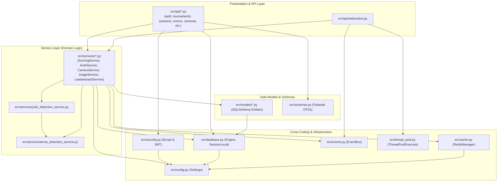

# Dependencies & Package Graph — Automated Archery Scoring System (SPL-3)

**Lifecycle Stage**: Inception / Reverse Engineering  
**Standard**: AIDLC Process Guidelines (`inception/reverse-engineering.md`)

---

## 1. Internal Module Dependency Graph

The following Mermaid diagram maps the flow of dependencies across the internal architecture:

---

## 2. External Python Dependencies

Derived from `pyproject.toml` and [Dockerfile](file:///c:/Users/BS01318/OneDrive%20-%20Brain%20Station%2023/Documents/GitHub/SPL-3/Dockerfile):

| Package | Version | License | Primary Function |
|---|---|---|---|
| `fastapi` | 0.110.0 | MIT | Web framework and routing engine |
| `uvicorn[standard]` | 0.27.0 | BSD-3-Clause | ASGI HTTP/WebSocket server |
| `sqlalchemy` | 2.0.23 | MIT | ORM and SQL abstraction |
| `psycopg2-binary` | 2.9.9 | LGPL with exception | PostgreSQL database adapter |
| `pydantic` | 2.5.3 | MIT | Data parsing and validation |
| `pydantic-settings`| 2.1.0 | MIT | Environment variable configuration |
| `torch` / `torchvision` | 2.x (CPU) | BSD-3-Clause | PyTorch deep learning framework |
| `ultralytics` | 8.3.241 | AGPL-3.0 | YOLO11 neural network engine |
| `opencv-python` | 4.8.1.78 | Apache-2.0 | Image processing and computer vision |
| `numpy` | 1.24.3 | BSD-3-Clause | Numerical matrix manipulation |
| `redis` | 5.0.1 | MIT | Redis cache client |
| `aioredis` | 2.0.1 | MIT | Async Redis support |
| `passlib[bcrypt]` | 1.7.4 | BSD | Password hashing library |
| `bcrypt` | 4.1.2 | Apache-2.0 | Cryptographic hash primitives |
| `python-jose` | 3.3.0 | MIT | JWT token generation and validation |
| `PyJWT` | 2.8.0 | MIT | Standard JWT encoding/decoding |
| `slowapi` | 0.1.9 | MIT | API rate limiting middleware |
| `structlog` | 24.1.0 | Apache-2.0 / MIT | Structured JSON logging |
| `alembic` | 1.12.0 | MIT | Database schema migrations |
| `pillow` | 10.0.0 | HPND | Image manipulation and encoding |
| `httpx` | 0.25.2 | BSD-3-Clause | Async HTTP client for tests and external requests |

---

## 3. External Frontend Dependencies

Derived from [frontend/package.json](file:///c:/Users/BS01318/OneDrive%20-%20Brain%20Station%2023/Documents/GitHub/SPL-3/frontend/package.json):

| Package | Version | License | Primary Function |
|---|---|---|---|
| `react` / `react-dom` | ^19.2.x | MIT | Core UI component framework |
| `react-router-dom` | ^7.17.0 | MIT | Client-side declarative routing |
| `zustand` | ^5.0.14 | MIT | Global client state management |
| `axios` | ^1.17.0 | MIT | HTTP client with interceptors |
| `recharts` | ^3.8.1 | MIT | Data visualization and SVG charts |
| `lucide-react` | ^1.17.0 | MIT | UI icons |
| `clsx` / `tailwind-merge`| ^2.1.1 / ^3.6.0| MIT | Dynamic CSS utility class merging |
| `zod` | ^4.4.3 | MIT | TypeScript-first schema validation |
| `react-hook-form` | ^7.77.0 | MIT | High-performance form state handling |
| `date-fns` | ^4.4.0 | MIT | Date manipulation and formatting |
| `tailwindcss` | ^4.3.0 | MIT | Utility-first CSS framework |
| `vite` | ^8.0.12 | MIT | Frontend build tool and bundler |
